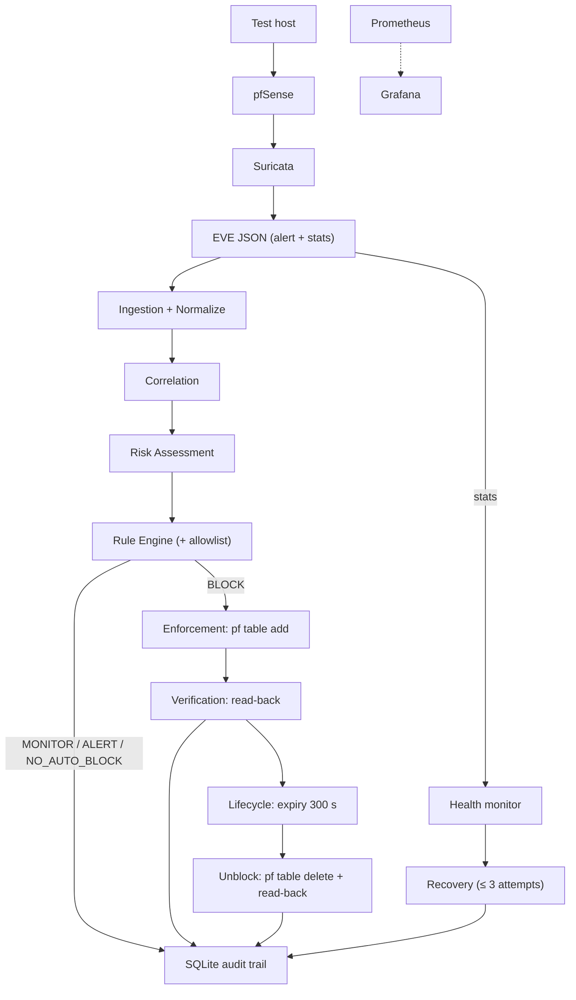
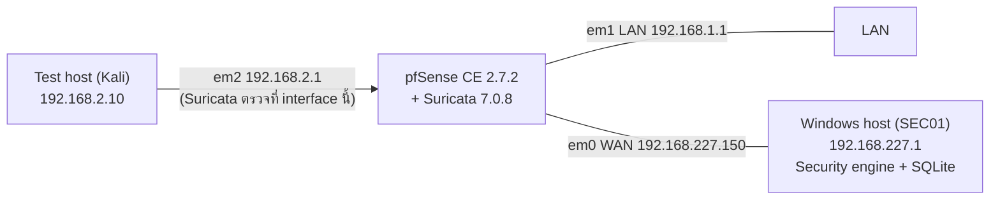
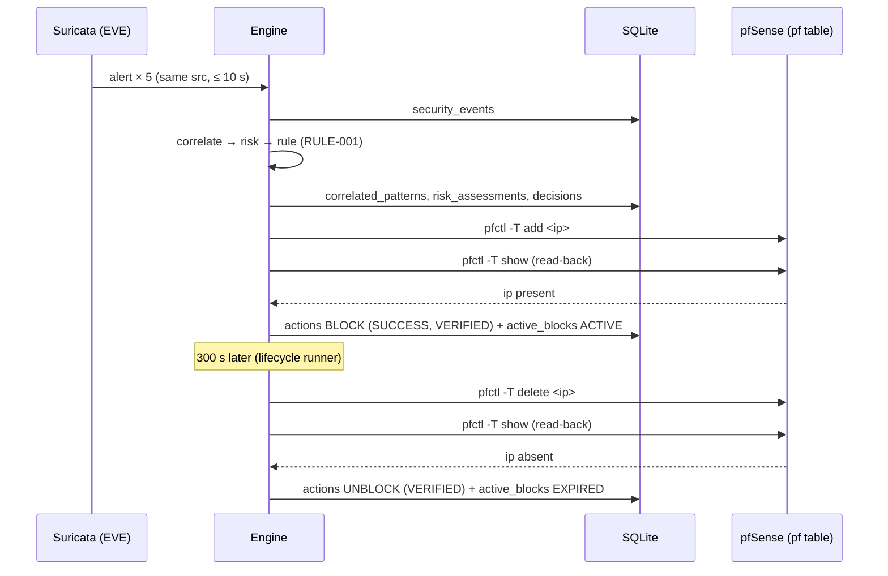
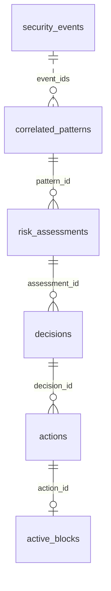

# บทที่ 3 การวิเคราะห์และออกแบบระบบ

บทนี้อธิบายการออกแบบระบบตามที่ implement และใช้ในการทดลองจริง ค่าพารามิเตอร์ทุกค่าในบทนี้ตรวจเทียบกับ source code และไฟล์ตั้งค่า
(`config/config.yaml`, `config/rules.yaml`) ของระบบ

## 3.1 ภาพรวมสถาปัตยกรรม

ระบบแบ่งหน้าที่ตามหลัก "Suricata = เห็น · Python = คิด · pfSense = ทำ · SQLite = จำ" Suricata ตรวจจับและส่งออกเหตุการณ์,
security engine ที่เขียนด้วย Python วิเคราะห์และตัดสินใจ, pfSense บังคับใช้การปิดกั้น และ SQLite บันทึกทุกขั้นตอนเป็น audit trail

**ตาราง 3.1** องค์ประกอบของระบบ

| องค์ประกอบ | หน้าที่ | สถานะในโครงงาน |
|---|---|---|
| Test host (Kali Linux) | แหล่งทราฟฟิกทดสอบที่ควบคุมได้ (ตามการออกแบบ) | ทราฟฟิกจริงจาก test host ไม่ได้อยู่ในชุดข้อมูลหลัก ซึ่งใช้ controlled EVE injection (บทที่ 5) · IP ของ test host ใช้เป็น source ของสถานการณ์ allowlist (T5) |
| pfSense (CE 2.7.2) | firewall/router · บังคับใช้การปิดกั้นผ่าน pf table | ใช้งาน |
| Suricata (7.0.8) | IDS · ส่งออก alert และ stats เป็น EVE JSON | ใช้งาน |
| Security engine (Python) | ingestion, correlation, risk assessment, rule engine, enforcement, verification, lifecycle, audit, health/recovery | ใช้งาน |
| SQLite | audit trail และสถานะการปิดกั้น | ใช้งาน |
| Prometheus + Grafana | monitoring และแสดงผลข้อมูลโครงสร้างพื้นฐาน (evidence เท่านั้น ไม่ใช่ข้อมูลนำเข้าของการตัดสินใจ) | **อยู่ในการออกแบบ แต่ไม่ได้ติดตั้งในโครงงานนี้** |

**รูปที่ 3.1** สถาปัตยกรรมของระบบ (เส้นประ = อยู่ในการออกแบบแต่ไม่ได้ implement)

เส้นทางหลักคือ DETECT → CORRELATE → ASSESS → DECIDE → ENFORCE → VERIFY → AUDIT และมีเส้นทางคู่ขนาน HEALTH CHECK → RECOVER

**หลักการออกแบบที่กำหนดไว้ (design decisions)**

| # | หลักการ | เหตุผล |
|---|---|---|
| D1 | คะแนนความเสี่ยง ≠ การตัดสินใจ — rule engine เป็นผู้ตัดสิน | อธิบายได้ว่าการตอบสนองเกิดจากเงื่อนไขใด |
| D2 | ข้อมูล monitoring ไม่เป็นข้อมูลนำเข้าของคะแนนความเสี่ยง | CPU/RAM ไม่ได้บ่งบอกเหตุการณ์ด้านความปลอดภัย |
| D3 | การตอบสนอง 3 ระดับ: MONITOR / ALERT / BLOCK | — |
| D4 | allowlist มีผลเหนือการปิดกั้น แต่ไม่ลบคะแนนความเสี่ยง | เหตุการณ์ยังเกิดจริง ผู้ดูแลต้องเห็น |
| D5 | ระยะเวลาปิดกั้น 300 s ปรับค่าได้ | เป็นพารามิเตอร์ของการทดลอง ไม่อ้างว่าเป็นค่า optimal |
| D6 | การกู้คืนตรวจจากสุขภาพเชิงฟังก์ชัน ไม่ใช่แค่ process | process อยู่แต่อาจไม่ผลิตผลลัพธ์ |
| D7 | ตรวจสุขภาพจาก `event_type: stats` ใน EVE | ความเงียบของเครือข่าย ≠ Suricata เสีย |
| D8 | สถานะการปิดกั้นเก็บใน SQLite ไม่ใช่หน่วยความจำ | ทนต่อการ restart ของ engine |

## 3.2 Network Architecture

**รูปที่ 3.2** โครงสร้างเครือข่ายของห้องปฏิบัติการ

pfSense และ Suricata ทำงานใน GNS3 บน VMware ส่วน security engine ทำงานบนเครื่อง Windows host (SEC01) และติดต่อกับ pfSense ผ่าน SSH
ด้วย key-based authentication ทั้งการอ่าน EVE, การสั่ง/ตรวจสอบ pf table และการตรวจ/สั่ง restart Suricata ค่า host และ path ของ EVE
ส่งให้ engine ผ่าน environment variable เพื่อไม่ให้ข้อมูลการเชื่อมต่อฝังอยู่ในไฟล์ตั้งค่า

## 3.3 Suricata IDS

Suricata ตรวจทราฟฟิกที่ interface em2 ตามกฎที่ตั้งค่าไว้ และเขียนผลลัพธ์ลงไฟล์ EVE สองประเภทที่ระบบใช้ ได้แก่

- `alert` — เหตุการณ์ที่ตรงกับกฎ มี `src_ip`, `dest_ip`, `alert.signature_id`, `alert.signature` และ `alert.severity`
  (1 = HIGH, 2 = MEDIUM, 3 = LOW ตามแนวของ Suricata ที่เลขน้อยสำคัญกว่า)
- `stats` — ตัวนับสถิติที่ Suricata เขียนเป็นระยะ ในห้องปฏิบัติการตั้งช่วงเวลาไว้ 10 s ต้องเปิด "EVE Logged Info: Perf Stats" ใน pfSense
  และค่านี้ต้องถูกบันทึกในการตั้งค่าของ pfSense เพราะไฟล์ตั้งค่าของ Suricata ถูกสร้างใหม่จากการตั้งค่าของ pfSense ทุกครั้งที่บูต

## 3.4 EVE JSON → Event Processing

Engine อ่าน EVE ต่อเนื่องด้วย `tail -n 0 -F` ผ่าน SSH (อ่านเฉพาะบรรทัดใหม่ และตามไฟล์ต่อเมื่อไฟล์ถูกหมุนเวียน) แต่ละบรรทัดถูกแยกตาม
`event_type`:

| event_type | การจัดการ |
|---|---|
| `alert` | แปลงเป็นรูปแบบภายใน (normalize) แล้วส่งเข้า pipeline |
| `stats` | ส่งให้ health monitor เป็นหลักฐานว่า Suricata ยังเขียนผลลัพธ์ (ไม่เข้า pipeline) |
| อื่น ๆ | บันทึกระดับ DEBUG แล้วทิ้ง (ไม่เดา schema ไม่นับเป็น alert) |

alert ทุกรายการถูกบันทึกลงตาราง `security_events` พร้อม raw JSON เป็นหลักฐาน ก่อนผ่านขั้นตอนถัดไป

## 3.5 Event Correlation

Correlation engine รวม alert ตาม **source IP** ภายใน **sliding time window 10 s** และสร้างรูปแบบ (correlated pattern) เมื่อจำนวน alert
ของ source เดียวกันในหน้าต่างเวลาถึง **5 รายการ** (`min_events`) รูปแบบที่ได้เก็บจำนวน event, ความรุนแรงสูงสุด (เลข severity น้อยที่สุด),
เวลาเริ่ม-สิ้นสุด และรายการ event ที่เกี่ยวข้อง

- หลังสร้างรูปแบบแล้ว source เดียวกันจะไม่ถูกสร้างรูปแบบซ้ำในช่วง **cooldown** (ค่าเริ่มต้นเท่ากับ window = 10 s) เพื่อไม่ให้ alert ชุดเดียว
  กลายเป็นหลายการตัดสินใจ
- alert ที่ยังไม่ถึงเกณฑ์ **ไม่ถูกสร้างเป็นรูปแบบ** และไม่ไปถึง risk assessment หรือ rule engine จึงไม่มีบันทึกการตัดสินใจ — สถานะนี้คือ
  การเฝ้าดู (MONITOR) โดยปริยาย

## 3.6 Risk Assessment

Risk assessment คำนวณคะแนนของรูปแบบที่เชื่อมโยงแล้ว โดยแปลงปัจจัยสี่ด้านเป็นคะแนน 0–100 ด้วยตาราง (lookup) แล้วถ่วงน้ำหนัก

$$R = S \cdot w_S + F \cdot w_F + T \cdot w_T + C \cdot w_C$$

**ตาราง 3.2** ชุดน้ำหนัก (Weight Set)

| Weight set | $w_S$ (Severity) | $w_F$ (Frequency) | $w_T$ (Temporal) | $w_C$ (Context) |
|---|---|---|---|---|
| A (ค่าเริ่มต้น) | 0.40 | 0.25 | 0.20 | 0.15 |
| B | 0.30 | 0.30 | 0.25 | 0.15 |
| C | 0.50 | 0.20 | 0.15 | 0.15 |

**ตาราง 3.3** การแปลงค่าปัจจัย (normalization)

| ปัจจัย | ข้อมูลนำเข้า | ค่า |
|---|---|---|
| S — Severity | ความรุนแรงสูงสุดของรูปแบบ (Suricata severity) | 1 → 75 · 2 → 50 · 3 → 25 · 0 (สงวนไว้สำหรับ signature วิกฤตที่โครงงานกำหนดเอง) → 100 · ค่าอื่น → 25 |
| F — Frequency | จำนวน event ในรูปแบบ | 1 → 20 · 2–3 → 40 · 4–5 → 70 · มากกว่า 5 → 100 |
| T — Temporal | ช่วงเวลาของรูปแบบ (เวลาสิ้นสุด − เวลาเริ่ม) | ≤ 10 s → 100 · ≤ 30 s → 75 · ≤ 60 s → 50 · มากกว่า 60 s → 25 |
| C — Context | บริบทของ **แหล่งที่มา** | อยู่ใน allowlist → 0 · known lab asset → 30 · unknown/external → 80 |

**ตาราง 3.4** ระดับความเสี่ยง (experimental classification thresholds)

| คะแนน | 0–29 | 30–59 | 60–79 | 80–100 |
|---|---|---|---|---|
| ระดับ | LOW | MEDIUM | HIGH | CRITICAL |

ตัวอย่าง: รูปแบบ 5 alert ความรุนแรง 1 ภายใน 10 s จาก source ภายนอก ได้ S = 75, F = 70, T = 100, C = 80 และด้วย Weight Set A
$R = 75(0.40) + 70(0.25) + 100(0.20) + 80(0.15) = 79.5$ (HIGH)

ข้อกำหนดสำคัญ:

- **risk assessment ไม่สั่งปิดกั้น** คะแนนและระดับใช้เพื่อประเมินและอธิบายการตัดสินใจ (บันทึกใน `risk_assessments`) ส่วนการเลือกการตอบสนอง
  เป็นหน้าที่ของ rule engine (หัวข้อ 3.7)
- รายการ known lab asset (C = 30) ว่างโดยตั้งใจ เพราะห้องปฏิบัติการไม่มี asset ที่ยืนยันบทบาทได้ จึงไม่ใส่ IP จากการคาดเดา
- ชุดน้ำหนักเลือกได้จากไฟล์ตั้งค่า (`risk.weight_set`) เพื่อใช้วิเคราะห์ความไว
- แบบจำลองนี้ออกแบบสำหรับการทดลองที่ควบคุมได้ อ้างอิงแนวคิดจาก CVSS และ NIST (บทที่ 2) แต่ไม่ใช่มาตรฐานสากล

## 3.7 Rule-Based Decision

Rule engine โหลดกฎจาก `config/rules.yaml` ประเมินตามลำดับความสำคัญ (priority น้อยประเมินก่อน) และใช้กฎแรกที่เงื่อนไขตรง (first match wins)

**ตาราง 3.5** กฎการตัดสินใจ

| Priority | Rule | เงื่อนไข | การตอบสนอง |
|---|---|---|---|
| 1 | RULE-003 | source อยู่ใน allowlist | NO_AUTO_BLOCK (+ ALERT + audit) |
| 2 | RULE-001 | severity ≥ HIGH, ≥ 5 events จาก source เดียวกัน, ภายใน 10 s, ไม่อยู่ใน allowlist | BLOCK 300 s |
| 3 | RULE-002 | severity ≥ MEDIUM, ≥ 5 events จาก source เดียวกัน, ภายใน 10 s | ALERT |
| — | default | ไม่ตรงกฎใด | MONITOR |

เงื่อนไขของกฎใช้เฉพาะ **ความรุนแรงของ alert, จำนวน event, ช่วงเวลา และ allowlist** — **ไม่มีกฎใดใช้ `risk_level` หรือ `risk_score` เป็นเงื่อนไข**
ผลที่ตามมาคือการเปลี่ยนชุดน้ำหนักจะเปลี่ยนคะแนนและระดับความเสี่ยงที่บันทึกไว้ได้ แต่ไม่มีเส้นทางที่จะเปลี่ยนการตอบสนอง

**Allowlist** มีผลสองชั้นโดยตั้งใจ: ในชั้น risk ทำให้ C = 0 (ลดคะแนนแต่ไม่ทำให้เป็นศูนย์) และในชั้น rule ทำให้ RULE-003 ซึ่งประเมินก่อน
มีผลเหนือ RULE-001 เหตุการณ์จาก source ใน allowlist จึงถูกบันทึกและแจ้งเตือน แต่ไม่ถูกปิดกั้นอัตโนมัติ

ทุกการตัดสินใจบันทึกลง `decisions` พร้อม `rule_id` และ `reason` ที่อ่านเข้าใจได้ ส่วน ALERT และ NO_AUTO_BLOCK บันทึกเป็น `actions.action = ALERT`
(ไม่มีคำสั่งไป firewall จึงมี command/verify result เป็น NOT_APPLICABLE)

## 3.8 pfSense Blocking และ Verification

Enforcement layer รู้เพียงสามอย่าง คือ block, unblock และตรวจสถานะ โดยไม่มีตรรกะของ risk, rule หรือเวลาหมดอายุปนอยู่ และทำงานผ่าน SSH ไปยัง
`pfctl` บน pf table `ITIS_BLOCK_TEST`

| การทำงาน | คำสั่ง |
|---|---|
| block | `pfctl -t ITIS_BLOCK_TEST -T add <ip>` |
| unblock | `pfctl -t ITIS_BLOCK_TEST -T delete <ip>` |
| verify | `pfctl -t ITIS_BLOCK_TEST -T show` |

หลักที่กำหนดคือ **command success ≠ enforcement success** ทุกการ add/delete ต้องอ่าน table กลับมา (read-back) และยืนยันว่า IP อยู่หรือหายจริงก่อน
รายงานว่าสำเร็จ ผลบันทึกแยกเป็น `command_result` และ `verify_result` การยืนยันนี้เป็นการยืนยัน**สถานะของ firewall** ไม่ใช่การทดสอบว่าทราฟฟิก
ถูกปิดกั้นจริงบนเส้นทางเครือข่าย

ลำดับของการบันทึก: การตัดสินใจถูกบันทึกลงฐานข้อมูล **ก่อน** สั่ง firewall เพื่อไม่ให้เกิดสถานะบน firewall ที่ไม่มีบันทึกรองรับ

**รูปที่ 3.3** ลำดับการทำงานจาก event ถึงการยกเลิกการปิดกั้น

## 3.9 Auto-Unblock และ Recovery

### 3.9.1 Block lifecycle

- เขียนสถานะ `ACTIVE` ลง `active_blocks` **เฉพาะเมื่อ** การปิดกั้นผ่านการ verify แล้ว (ฐานข้อมูลต้องไม่บอกว่าปิดกั้นทั้งที่ firewall ไม่ได้ปิดกั้น)
- lifecycle runner (thread แยก) ตรวจทุก 1 s หา block ที่ครบเวลา แล้ว unblock พร้อม verify: สำเร็จ → `EXPIRED`, ไม่สำเร็จ → `REMOVE_FAILED`
  และลองใหม่ได้ไม่เกิน 3 ครั้ง ถ้ายังไม่สำเร็จจะหยุดลองและแจ้งระดับ CRITICAL โดยคงสถานะ `REMOVE_FAILED` ไว้ ไม่เขียนว่า EXPIRED
- **Duplicate handling:** source ที่มี block `ACTIVE` อยู่แล้วจะไม่ถูกสั่งปิดกั้นซ้ำ และไม่เลื่อนเวลาหมดอายุ
- **Restart resilience:** เมื่อ engine เริ่มทำงาน จะ reconcile สถานะใน SQLite กับ firewall และจัดการ block ที่ครบเวลาระหว่างที่ engine หยุด

### 3.9.2 Suricata health และ recovery

**ตาราง 3.6** สถานะสุขภาพ

| สถานะ | เงื่อนไข |
|---|---|
| HEALTHY | process ของ Suricata ทำงาน **และ** มี stats ใหม่ภายใน 30 s (stats interval 10 s × 3) |
| DEGRADED | process ไม่ทำงาน (`PROCESS_DOWN`) หรือ stats ขาดหายเกิน 30 s (`EVE_STALE`) |
| CRITICAL | การกู้คืนล้มเหลวครบ 3 ครั้ง |

- Health runner (thread แยก) ตรวจทุก 15 s ตรวจ process ด้วย `pgrep -x suricata` และอ่านเวลาของ stats ล่าสุดจาก EVE
- เมื่อ DEGRADED จะกู้คืนไม่เกิน 3 ครั้ง: สั่ง restart → ถ้าคำสั่ง restart สำเร็จ ตรวจซ้ำทุก 5 s (ครั้งแรกหลังรอ 5 s) รวมไม่เกิน 30 s **การกู้คืนนับว่าสำเร็จเมื่อมี stats
  ของ process ใหม่** (ตรวจจาก `uptime` ใน stats) ไม่ใช่แค่ restart คืนค่าสำเร็จ เพื่อไม่ให้ stats ที่ process เก่าเขียนไว้ก่อนหยุดทำงานถูกนับเป็นหลักฐาน
- ถ้าคำสั่ง restart คืนค่าล้มเหลว ระบบไปยัง attempt ถัดไป**ทันที**โดยไม่มีช่วงรอ (การรอ 5 s และการตรวจไม่เกิน 30 s เกิดเฉพาะหลัง restart สำเร็จ)
- ครบ 3 ครั้งแล้วยังไม่สำเร็จ → CRITICAL ระบบ**หยุดพยายาม restart** (ไม่มี attempt ที่ 4) จนกว่าสุขภาพจะกลับเป็น HEALTHY เอง แต่ engine ไม่หยุดทำงาน
- ทุก attempt บันทึกลง `recovery_events` (SUCCESS / FAIL / CRITICAL)

## 3.10 Data Flow และโครงสร้างฐานข้อมูล

ข้อมูลไหลผ่านฐานข้อมูลเป็นสายเดียวที่ย้อนกลับได้ทุกขั้น (audit chain) ฐานข้อมูลใช้ WAL mode และเปิด foreign key ทุก connection

**รูปที่ 3.4** ความสัมพันธ์ของตาราง

**ตาราง 3.7** ตารางในฐานข้อมูล

| ตาราง | เก็บอะไร |
|---|---|
| `security_events` | alert ทุกรายการ + raw JSON |
| `correlated_patterns` | รูปแบบที่เชื่อมโยงแล้ว: source, ช่วงเวลา, จำนวน, ความรุนแรงสูงสุด, event ids |
| `risk_assessments` | S, F, T, C, weight set, risk score, risk level |
| `decisions` | rule_id, decision, allowlisted, reason |
| `actions` | BLOCK / UNBLOCK / ALERT พร้อม command_result, verify_result, error |
| `active_blocks` | สถานะปัจจุบันของการปิดกั้นต่อ source: ACTIVE / EXPIRED / MANUALLY_REMOVED / REMOVE_FAILED |
| `recovery_events` | service, failure_reason, attempt, result และ error (ข้อความผิดพลาดพร้อม return code) ของการกู้คืน Suricata |
| `experiment_timestamps` | จุดเวลาสำหรับวัดผลการทดลอง (t_event, t_detection, t_decision, t_block_cmd, t_block_verified) |

`active_blocks` ใช้ source IP เป็น primary key จึงเก็บเฉพาะสถานะล่าสุดของแต่ละ source ประวัติการปิดกั้นทั้งหมดอยู่ใน `actions`

## 3.11 Component / Module Design

**ตาราง 3.8** module ของ security engine

| Module | หน้าที่ |
|---|---|
| `ingestion/eve_reader.py` | อ่าน EVE ผ่าน SSH, แยก alert/stats, normalize |
| `correlation/engine.py` | sliding window ต่อ source, min_events, cooldown |
| `scoring/risk.py` | lookup S/F/T/C, weight set, risk level |
| `policy/rule_engine.py`, `rules_config.py` | โหลดและประเมินกฎ (first match) |
| `policy/allowlist.py`, `assets.py`, `source_context.py` | allowlist และบริบทของ source (factor C) |
| `enforcement/pfsense_enforcer.py` | pfctl add/delete/show ผ่าน SSH + read-back |
| `lifecycle/block_store.py`, `block_lifecycle.py`, `runner.py` | สถานะการปิดกั้น, หมดอายุ, unblock, reconcile |
| `storage/schema.py`, `repository.py` | schema และการบันทึก audit |
| `health/monitor.py`, `recovery.py`, `runner.py`, `suricata_controller.py` | ตรวจสุขภาพ, กู้คืน, สั่ง restart |
| `pipeline.py` | ประกอบสายการทำงานต่อ event และถือ lock ร่วมกับ lifecycle runner |
| `experiment/timestamp_sink.py` | บันทึก `experiment_timestamps` เมื่อรันในโหมดทดลอง |
| `settings.py`, `logging_config.py` | โหลด/ตรวจความครบของไฟล์ตั้งค่า, logging |

**ตาราง 3.9** พารามิเตอร์ของระบบ

| พารามิเตอร์ | ค่า |
|---|---|
| correlation window / min_events / cooldown | 10 s / 5 / 10 s |
| block duration | 300 s |
| lifecycle check interval | 1 s |
| health check interval / stats interval / freshness | 15 s / 10 s / 30 s |
| recovery: restart wait / max attempts | 5 s / 3 |
| unblock retry | 3 |
| weight set | A (เลือกได้ A/B/C) |

## 3.12 การออกแบบการทดลอง

การออกแบบการทดลอง (สถานการณ์ T1–T11, ตัวชี้วัด M1–M10 และการครอบคลุม M11–M14 ของ Blueprint, วิธีป้อนข้อมูล และวิธีบันทึกเวลา) อธิบายในบทที่ 5
ในระดับการออกแบบระบบ ส่วนที่รองรับการทดลองคือ `experiment_timestamps` ซึ่งบันทึกจุดเวลาของแต่ละขั้นในเส้นทางการตอบสนอง
และการระบุ test/run ของการทดลองแต่ละครั้ง โดยไม่เปลี่ยนตรรกะของ pipeline
