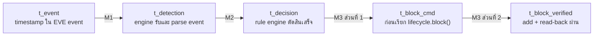

# บทที่ 5 การทดลองและการประเมินผล

บทนี้อธิบาย**วิธี**ทดลองและ**วิธี**วัดผล ได้แก่ สภาพแวดล้อม การเตรียมระบบ สถานการณ์ทดสอบ T1–T11 การเก็บ timestamp นิยามตัวชี้วัด
M1–M10 วิธีวิเคราะห์ และการควบคุมความถูกต้องของชุดข้อมูล ค่าที่วัดได้และการอภิปรายผลอยู่ในบทที่ 6

ข้อกำหนดในบทนี้ยึดตามแผนการทดลองที่ล็อกไว้ก่อนเริ่มการทดลอง และตรวจเทียบกับหลักฐานของชุดข้อมูลที่ปิดการแก้ไข (freeze) แล้ว หากสิ่งที่ทำจริง
ต่างจากแผน บทนี้จะระบุไว้ในหัวข้อนั้นเลย

## 5.1 สภาพแวดล้อมการทดลอง

การทดลองทำในห้องปฏิบัติการเสมือน (controlled laboratory environment) บนคอมพิวเตอร์เครื่องเดียว pfSense และ Suricata ทำงานเป็น node
ใน GNS3 ซึ่งรันบน VMware Workstation ส่วน security engine ทำงานบน Windows host ของเครื่องเดียวกัน (เรียกว่า SEC01)

**ตาราง 5.1** ฮาร์ดแวร์และซอฟต์แวร์ที่ใช้ในการทดลอง

| องค์ประกอบ | รายละเอียด | บทบาทในการทดลอง |
|---|---|---|
| เครื่อง host (SEC01) | Intel Core i5-13400F · RAM 32 GB · Windows 11 Education | รัน security engine, SQLite, generator และ GNS3/VMware |
| Virtualization | VMware Workstation 17.6.4 · GNS3 2.2.58.1 | จำลองเครือข่ายของห้องปฏิบัติการ |
| Firewall | pfSense CE 2.7.2 (FreeBSD 14.0-CURRENT) | บังคับใช้การปิดกั้นผ่าน pf table `ITIS_BLOCK_TEST` |
| IDS | Suricata 7.0.8 (package บน pfSense) ตรวจที่ interface em2 | เขียน EVE JSON (`alert`, `stats`) · เป้าหมายของ fault injection ใน T8/T9 |
| Security engine | Python 3 (tested on Python 3.14.5) · PyYAML 6.0.3 | ingestion → correlation → risk → rule → enforcement → verification → audit · health/recovery |
| ฐานข้อมูล | SQLite 3.50.4 (ผ่านโมดูล `sqlite3` ของ Python) | audit trail 8 ตาราง รวม `experiment_timestamps` |
| การเชื่อมต่อ | OpenSSH client · key-based authentication | อ่าน EVE, สั่ง/อ่านกลับ pf table, ตรวจ/สั่ง restart Suricata |
| Test host | Kali Linux `192.168.2.10` เชื่อมกับ em2 | ตามการออกแบบเป็นแหล่งทราฟฟิกทดสอบ · ในชุดข้อมูลหลัก ใช้เพียง IP นี้เป็น source ของสถานการณ์ allowlist (T5) |
| Monitoring (Prometheus + Grafana) | — | **ไม่ได้ติดตั้งในการทดลองนี้** จึงไม่มีข้อมูล CPU/RAM/PPS |

เวอร์ชันของ pfSense, FreeBSD และ Suricata อ่านจากเครื่องในห้องปฏิบัติการ (`uname -sr`, `suricata -V`) ส่วนเวอร์ชันของซอฟต์แวร์บน host
เป็นเวอร์ชันที่ตรวจสอบได้ ณ วันที่เขียนรายงาน (26 กันยายน 2026)

**โครงสร้างเครือข่าย** เป็นไปตามรูปที่ 3.2 pfSense มี WAN (em0) `192.168.227.150` ที่ต่อกับ host `192.168.227.1`, LAN (em1)
`192.168.1.1` และ em2 `192.168.2.1` ซึ่งเป็น interface ที่ Suricata ตรวจ engine ติดต่อ pfSense ผ่าน SSH ที่ WAN เท่านั้น

**บทบาทของ EVE JSON** — Suricata เขียนผลลงไฟล์ `/var/log/suricata/suricata_em224404/eve.json` บน pfSense engine อ่านไฟล์นี้ต่อเนื่องด้วย
`tail -n 0 -F` ผ่าน SSH (หัวข้อ 4.3) ไฟล์นี้จึงเป็นทางเข้าเดียวของทั้ง security event และ health signal
(`event_type: stats` ทุก 10 s) ส่วนเส้นทางออกของการตอบสนองคือคำสั่ง `pfctl -t ITIS_BLOCK_TEST -T add|delete|show` ผ่าน SSH

**ตาราง 5.2** พารามิเตอร์ของระบบระหว่างการทดลอง (ตรงกับ `config/config.yaml` และ `config/rules.yaml`)

| พารามิเตอร์ | ค่า |
|---|---|
| Correlation window / min_events / cooldown | 10 s / 5 / 10 s |
| Block duration (RULE-001) | 300 s |
| Weight set | A (T1–T10) · A, B, C (T11) |
| Health check interval / stats interval / stats freshness | 15 s / 10 s / 30 s |
| Restart command | `/usr/local/etc/rc.d/suricata.sh restart` (T9 เปลี่ยนชั่วคราว ดูหัวข้อ 5.4.9) |
| Restart wait / max recovery attempts | 5 s / 3 |
| Allowlist | ว่าง (T5 เพิ่ม `192.168.2.10` ชั่วคราว) |
| Known lab assets | ว่างโดยตั้งใจ (factor C = 30 จึงไม่ถูกทดสอบ) |

## 5.2 การเตรียมระบบก่อนการทดลอง

### 5.2.1 เงื่อนไขก่อนเริ่มชุดการทดลอง

**ตาราง 5.3** เงื่อนไขก่อนเริ่มชุดการทดลอง (P1–P8)

| # | เงื่อนไข | เหตุผล |
|---|---|---|
| P1–P2 | ปรับนาฬิกา SEC01 และวัด clock offset ระหว่าง SEC01 กับ pfSense ต้นและท้ายชุด (หัวข้อ 5.5.3) | ใช้ประกอบการตีความ latency |
| P3 | ตั้ง `ITIS_PFSENSE_HOST` และ `ITIS_EVE_PATH` | engine หยุดทันทีถ้าไม่มี (NFR-07) |
| P4 | ค่าในตาราง 5.2 ตรงกับค่าที่จะรายงาน | ทุกตารางผลอ้างค่าเหล่านี้ |
| P5 | `restart_command` เป็นคำสั่งที่ใช้ได้จริงบน pfSense | ถ้าผิด T8 จะไม่มีทางผ่าน |
| P6 | เพิ่ม `192.168.2.10` ใน allowlist **เฉพาะช่วง T5** แล้วลบออกและตรวจว่าไม่มี IP ค้าง | T5 ใช้ allowlist เป็น source of truth |
| P7 | ใช้ฐานข้อมูลใหม่ที่ว่างสำหรับการทดลองนี้ | แยกจากข้อมูลช่วงพัฒนาและการทดสอบก่อนหน้า |
| P8 | เปิด "Perf Stats" ใน pfSense ให้ Suricata เขียน `stats` ลง EVE และถ้าแก้ค่า Suricata ต้อง restart แล้วตรวจว่า PID เปลี่ยน | การกด Save ใน GUI ไม่ restart process ค่าใหม่จึงยังไม่มีผล |

### 5.2.2 การตรวจก่อนแต่ละ run

ก่อนเริ่มแต่ละ run ต้องตรวจว่าไม่มี engine process ค้าง, pf table `ITIS_BLOCK_TEST` ว่าง, Suricata ทำงานอยู่ (`pgrep -x suricata`) และจำนวนแถว
ของทุกตารางถูกจดไว้เพื่อหาผลต่างหลังจบ run ถ้าเงื่อนไขใดไม่ผ่าน run นั้นจะถูกยกเลิกก่อนป้อน input

### 5.2.3 Dry run ก่อนเก็บข้อมูลจริง

ก่อนเริ่ม T1 มีการทดสอบทั้งเส้นทาง (DRYRUN-T4, run_id `T4-R00`) ด้วย input แบบเดียวกับ T4 เพื่อยืนยันว่าทั้งเส้นทางทำงานบนห้องปฏิบัติการจริง ตั้งแต่
ingestion จนถึง BLOCK, VERIFIED, UNBLOCK และการบันทึก timestamp ครบ 5 จุด ผลของ dry run เก็บในฐานข้อมูลแยก **ไม่รวมอยู่ในชุดข้อมูล**
และไม่นับเป็น run ของ T4 (`R00` สงวนไว้สำหรับ dry run เท่านั้น)

## 5.3 วิธีการทดลอง

### 5.3.1 การป้อนข้อมูลเข้า: controlled EVE injection

ชุดข้อมูลหลักใช้ **controlled EVE injection** แทนการยิงทราฟฟิกจริงจาก test host

```
generate_test_events.py --test-id <T> [--variant x] --run <n> --spacing 0
    | ssh <pfSense> 'cat >> /var/log/suricata/suricata_em224404/eve.json'
```

- `scripts/generate_test_events.py` สร้าง EVE alert ตามสถานการณ์ในหัวข้อ 5.4 (source, severity, จำนวน) โดยใส่ timestamp จากนาฬิกา SEC01 ขณะสร้าง
  แล้วต่อท้ายลงไฟล์ EVE ตัวจริงบน pfSense engine จึงอ่าน event เหล่านี้ผ่านเส้นทางเดียวกับ alert ที่ Suricata เขียนเอง
- generator สร้าง**เฉพาะ input** ส่วนการ correlate, การตัดสินใจ, การปิดกั้น และการกู้คืนมาจาก engine ทั้งหมด
- ใช้ `--spacing 0` ทุกครั้ง event ทุกตัวใน pattern จึงมี timestamp เดียวกัน ถ้าใช้ค่าเริ่มต้น (ห่างกัน 1 s) event ที่ถูกต่อท้ายพร้อมกันจะมี
  timestamp ล้ำอนาคต ทำให้ latency ติดลบหรือสั้นกว่าจริง ผลข้างเคียงคือ input เป็น burst (factor T = 100) ไม่ได้จำลอง event ที่กระจายตลอด 10 s
- source ที่ไม่อยู่ใน allowlist ใช้ `198.51.100.77` (TEST-NET-2 ตาม RFC 5737) จึงไม่ชนกับ host จริง

**เหตุผลที่เลือกวิธีนี้:** (1) ควบคุม severity, จำนวน และ source ได้แน่นอน ผลจึงทำซ้ำได้ (2) `t_event` กับ timestamp อื่นมาจากนาฬิกาเดียวกัน
ทำให้ M1/M4 ไม่มี clock offset ระหว่างเครื่องปนอยู่ (หัวข้อ 5.5.2)

**ขอบเขต:** วิธีนี้ทดสอบเส้นทางตั้งแต่ EVE JSON เป็นต้นไป ไม่ได้ทดสอบว่า Suricata ตรวจจับ packet จริงได้ ทราฟฟิกจริงจาก Kali จึงไม่อยู่ในชุดข้อมูลหลัก
ถ้าจะใช้ ต้องแยกเป็น supplementary validation ที่ไม่รวมกับผลของ T1–T11 ส่วน T1 ไม่ inject อะไรเลย และ T8/T9 ใช้ fault injection
แทนการป้อน event

### 5.3.2 ขั้นตอนของหนึ่ง run

```text
1 ตรวจก่อนเริ่ม (5.2.2)
2 เริ่ม engine ใหม่: run_phase4.py --test-id <T> --run-id <T>-R<NN>
3 รอ log "เริ่มอ่าน EVE จาก ..." และตรวจว่า path ของ EVE ถูกต้อง
4 ป้อน input: EVE injection (T2–T7, T10, T11) · ไม่ป้อน (T1) · หยุด Suricata (T8, T9)
5 รอตามช่วงสังเกตของสถานการณ์ (ตาราง 5.6)
6 หยุด engine · หาผลต่างของแต่ละตาราง · อ่าน pf table และ PID ของ Suricata
7 เก็บหลักฐาน: ช่วง log ของ run, สรุปผล, registry, แถวใน results CSV
```

**1 process = 1 run** — engine เริ่มใหม่ทุก run และผูก `test_id` + `run_id` ไว้ตลอดอายุ process แถวใน `experiment_timestamps` จึงระบุ run ได้
โดยไม่ต้องตีความภายหลัง run_id ต้องอยู่ในรูป `<test_id>-R<NN>` ถ้าผิดรูปแบบ engine จะออกก่อนอ่าน config หรือแตะ pfSense

### 5.3.3 จำนวนรอบ

**ตาราง 5.4** จำนวนรอบและ run_id ของการทดลอง

| ชุด | รอบ | run_id |
|---|---|---|
| T1–T9 | 5 ต่อ test (45) | `T<n>-R01` … `R05` |
| T10 | 5 ต่อ variant (10) | a = `T10-R01` … `R05` · b = `T10-R06` … `R10` |
| T11 | 3 (หนึ่งรอบต่อ weight set) | `T11-R01` = A · `R02` = B · `R03` = C |
| **รวม** | **58 runs** | — |
| DRYRUN-T4 | 1 | `T4-R00` — ไม่อยู่ในชุดข้อมูล |

- Blueprint §14.3 กำหนดขั้นต่ำ 5 repetitions ต่อ test จุดประสงค์คือดูว่าผลซ้ำได้สม่ำเสมอในห้องปฏิบัติการหรือไม่ **ไม่ใช่**การอนุมานทางสถิติ
- T10 มีสองรูปแบบของ false-positive simulation ที่ทดสอบคนละเงื่อนไข จึงรันรูปแบบละ 5 รอบและให้ run_id ไม่ซ้ำกัน
- T11 เปรียบเทียบ weight set สามชุดด้วย pattern เดียวกัน ผลของแต่ละชุดถูกกำหนดด้วยการคำนวณ จึงไม่ต้องทำซ้ำหลายรอบ

### 5.3.4 ช่วงเวลาการทดลอง

การทดลองแบ่งเป็นสองชุด ชุดที่ 1 วันที่ 24 กันยายน 2026 (T1–T8) และชุดที่ 2 วันที่ 25 กันยายน 2026 (T9–T11) ระหว่างชุดมีการปิดและเปิดเครื่อง
host และ pfSense ใหม่ จึงต้องตรวจสภาพแวดล้อมก่อนเริ่มชุดที่ 2 อีกครั้ง

### 5.3.5 การแก้ไข implementation ระหว่างการทดลอง (Implementation revisions during experimentation)

ตามกฎ freeze ห้ามแก้ weight, threshold, window, block duration, allowlist logic, schema และ timestamp protocol ระหว่างการทดลอง
ยกเว้นพบข้อบกพร่องที่ทำให้ระบบไม่ตรงกับ Blueprint ในกรณีนั้นต้องหยุด แก้ ทดสอบ commit บันทึก แล้วจึงรันเฉพาะชุดที่ได้รับผลกระทบ

ระหว่างการทดลองเกิดกรณีนี้หนึ่งครั้ง ก่อนเริ่ม T11 พบว่า entry point บันทึกค่า `risk.weight_set` ลง log แต่**ไม่ส่งค่าเข้า pipeline**
ทำให้ทุกการคำนวณใช้ Set A (หัวข้อ 4.2) ถ้าไม่แก้ T11 จะวัดอะไรไม่ได้ จึงแก้และเพิ่ม test ก่อนรัน T11

**ตาราง 5.5** revision ของโค้ดที่ใช้ในแต่ละช่วง

| ช่วง | runs | code revision |
|---|---|---|
| T1–T10 | 55 | `236ce70` (จุด freeze ของการทดลอง) |
| T11 | 3 | `d0a346d` (แก้การส่ง `risk.weight_set` เข้า pipeline) |

T1–T10 ตั้งค่า `weight_set: "A"` ซึ่งเป็นค่าเดียวกับที่ pipeline ใช้โดยปริยาย ข้อบกพร่องนี้จึงไม่เปลี่ยนการคำนวณของ T1–T10 และไม่มีการรัน T1–T10 ใหม่
อย่างไรก็ตาม **T1–T11 ไม่ได้รันบน revision เดียวกัน** รายงานนี้จึงระบุ revision แยกตามตาราง 5.5 เสมอ

## 5.4 Test Scenarios

สถานการณ์ทดสอบเป็นไปตาม Blueprint §14.4 `Expected` คือผลที่กำหนดไว้ก่อนการทดลองและห้ามแก้ให้ตรงกับผลที่ได้

**ตาราง 5.6** สรุปสถานการณ์ทดสอบ

| Test | Input | Expected | ช่วงสังเกตต่อ run (ประมาณ) | Runs | Metrics |
|---|---|---|---|---|---|
| T1 | ไม่มี alert (สังเกตทราฟฟิกปกติ) | MONITOR · ไม่มี block · HEALTHY | 60 s | 5 | M5, M7 |
| T2 | 1 × MEDIUM | MONITOR · ไม่มี block | 30 s | 5 | M5, M7 |
| T3 | 5 × MEDIUM · source เดียว · ≤ 10 s | RULE-002 ALERT · ไม่มี block | 30 s | 5 | M1, M2, M5, M7 |
| T4 | 5 × HIGH · source เดียว · ≤ 10 s · ไม่อยู่ใน allowlist | RULE-001 BLOCK → VERIFIED | 320 s (จนหมดอายุ) | 5 | M1–M6 |
| T5 | เหมือน T4 แต่ source อยู่ใน allowlist | RULE-003 NO_AUTO_BLOCK + ALERT + audit | 30 s | 5 | M8 |
| T6 | เหมือน T4 | BLOCK → 300 s → UNBLOCK → VERIFY → EXPIRED | 320 s | 5 | M9 |
| T7 | เหมือน T4 | VERIFIED จากการอ่านกลับ ไม่ใช่แค่ command สำเร็จ | 320 s | 5 | M6 |
| T8 | หยุด Suricata ระหว่าง engine ทำงาน | DEGRADED → restart → HEALTHY | 120 s หลัง fault | 5 | M10 |
| T9 | หยุด Suricata + restart ใช้ไม่ได้ | FAIL → FAIL → CRITICAL · ไม่มี attempt 4 | 120 s หลัง fault | 5 | M10 (แยกรายงาน) |
| T10a | 1 × HIGH | MONITOR · ไม่มี block | 20 s | 5 | M7 |
| T10b | 4 × HIGH · ≤ 10 s | MONITOR · ไม่มี block | 20 s | 5 | M7 |
| T11 | pattern เดียวกับ T4 · Weight Set A, B, C | score เปลี่ยนตาม weight set · บันทึกว่า decision เปลี่ยนหรือไม่ | 320 s | 3 | sensitivity |

ความหมายของ severity ตามหัวข้อ 3.3: HIGH = Suricata severity 1, MEDIUM = severity 2

### 5.4.1 T1 Normal Traffic

ไม่ inject event ใด ๆ เปิด engine ไว้ 60 s นับจากเริ่มอ่าน EVE เพื่อสังเกตทราฟฟิกปกติของห้องปฏิบัติการและ `stats` จริงของ Suricata ไม่ inject `stats`
ปลอม เพราะจะปนกับ health signal ที่ใช้ `stats.uptime` เกณฑ์ผ่านคือทุกตารางไม่มีแถวใหม่ pf table ว่าง health เป็น HEALTHY ตลอด และ log ไม่มี
WARNING/ERROR แผนเดิมใน test plan ให้ generator ส่ง `stats` แต่ protocol ที่ล็อกก่อนเริ่มการทดลองแก้เป็นไม่ inject อะไรเลย

### 5.4.2 T2 Single Medium Alert

inject MEDIUM alert หนึ่งรายการ ใช้ทดสอบว่า alert เดี่ยวไม่ถูกสร้างเป็น correlated pattern เกณฑ์ผ่านคือ `security_events` มีหนึ่งแถว ไม่มีแถวใน
`correlated_patterns`, `decisions` และ `actions` สถานะ MONITOR ในกรณีนี้เป็นสถานะโดยปริยาย เพราะ alert ไม่ถึงเกณฑ์ correlation จึงไม่มีแถวใน
`decisions` (หัวข้อ 3.5)

### 5.4.3 T3 Repeated Medium Alerts

inject MEDIUM alert 5 รายการจาก source เดียวในคราวเดียว เกณฑ์ผ่านคือเกิด pattern, rule ที่ match คือ RULE-002, decision เป็น ALERT และมี
`actions.action = ALERT` หนึ่งแถว แต่ไม่มี BLOCK และ pf table ยังว่าง T3 เป็นหนึ่งในกลุ่มหลักของ M1/M2 เพราะผ่าน correlation, risk และ rule
ครบโดยไม่มีขั้น enforcement

### 5.4.4 T4 Critical Pattern

inject HIGH alert 5 รายการจาก `198.51.100.77` ซึ่งไม่อยู่ใน allowlist เกณฑ์ผ่านคือเกิด RULE-001 BLOCK, `actions.command_result = SUCCESS`
**และ** `verify_result = VERIFIED`, `active_blocks` เป็น ACTIVE พร้อม `action_id` และมีแถว `experiment_timestamps` ครบ 5 จุด engine ทำงานต่อ
จนครบ 300 s เพื่อให้ block หมดอายุและถูกปลดโดย engine เอง ไม่เหลือ block ค้างให้ run ถัดไป T4 เป็นสถานการณ์หลักของ M4

### 5.4.5 T5 Allowlisted Critical Pattern

ใช้ pattern เดียวกับ T4 แต่ source คือ `192.168.2.10` ซึ่งเพิ่มใน allowlist ชั่วคราวตาม P6 เกณฑ์ผ่านคือ RULE-003 NO_AUTO_BLOCK,
`decisions.allowlisted = 1`, มี ALERT action และไม่มีคำสั่ง BLOCK ไปถึง pfSense ต้องบันทึก risk score ตามค่าที่ engine คำนวณจริง ซึ่งควรต่ำลงเพราะ
factor C = 0 แต่ไม่เป็นศูนย์ หลังจบ T5 ต้องนำ IP ออกจาก allowlist และตรวจว่าไม่มีค่าทดลองค้างในไฟล์ตั้งค่า IP นี้เป็นของ Kali แต่ event ของ T5 มาจาก
injection ไม่ใช่จากทราฟฟิกของ Kali

### 5.4.6 T6 Auto-Unblock

input เหมือน T4 แต่สิ่งที่ทดสอบคือ lifecycle หลังการปิดกั้น ต้องรอให้ block หมดอายุจริง 300 s โดยไม่แก้ `expires_at` ในฐานข้อมูล เกณฑ์ผ่านคือมี
UNBLOCK action ที่ผลเป็น SUCCESS + VERIFIED, `active_blocks.status = EXPIRED` และ pf table ว่างหลังจบ run นอกจากนี้ต้องอ่าน pf table
ประมาณ 10 s หลัง inject เพื่อยืนยันว่า IP อยู่ใน table ในช่วงที่ block ยังมีผล

### 5.4.7 T7 Enforcement Verification

input เหมือน T4 ใช้พิสูจน์ว่า "คำสั่งสำเร็จ" ไม่เท่ากับ "การบังคับใช้สำเร็จ" แผนกำหนดการตรวจไว้สองชั้น

- **ชั้นที่ 1 — state read-back:** engine อ่าน pf table กลับหลังสั่ง add (`verify_result`) และผู้ทดลองอ่านซ้ำเองด้วย
  `pfctl -t ITIS_BLOCK_TEST -T show` ประมาณ 10 s หลัง inject
- **ชั้นที่ 2 — traffic-path verification:** ยิงทราฟฟิกจาก source ที่ถูก block เพื่อดูว่าถูก drop จริง **ชั้นนี้ไม่ได้ทำ** เพราะ source ของ input
  คือ `198.51.100.77` ซึ่งเป็น TEST-NET ไม่มี host จริงที่จะส่งทราฟฟิกได้

ผลของ T7 จึงยืนยันการบังคับใช้ได้**ในระดับสถานะของ firewall (read-back)** เท่านั้น ไม่ได้ยืนยันเส้นทางของทราฟฟิกโดยตรง

### 5.4.8 T8 Suricata Recovery

T8 ไม่ inject EVE หลังจาก engine รายงาน HEALTHY แล้ว ผู้ทดลองหยุด Suricata ด้วย `/usr/local/etc/rc.d/suricata.sh stop` ผ่าน SSH และบันทึกเวลาที่สั่ง
เป็น `t_fault` (นาฬิกา SEC01) จากนั้นปล่อยให้ engine ตรวจและกู้คืนเองภายใน 120 s ด้วย `restart_command` ปกติ เกณฑ์ผ่านคือ health เป็น DEGRADED
(PROCESS_DOWN และ/หรือ EVE_STALE), `recovery_events` มีแถว `result = SUCCESS`, Suricata มี PID ใหม่ และ `stats.uptime` เริ่มนับใหม่
ซึ่งยืนยันว่า stats มาจาก process ใหม่ แล้ว health กลับเป็น HEALTHY

T8 เป็น **recoverable failure** คือความล้มเหลวที่กลไกกู้คืนควรแก้ได้

### 5.4.9 T9 Recovery Failure

เพื่อจำลองกรณีที่ restart ใช้ไม่ได้ ช่วง T9 ตั้ง `health.restart_command` เป็น `/usr/bin/false` ชั่วคราว คำสั่งนี้คืนค่า rc = 1 เสมอ แล้วหยุด Suricata
แบบเดียวกับ T8 และสังเกต 120 s หลังจบ T9 คืนไฟล์ตั้งค่าเป็นค่าเดิมด้วย version control และหลังจบแต่ละ run สคริปต์ของการทดลองสั่ง start Suricata ด้วยคำสั่งจริง แล้วตรวจว่ามี
PID และ `stats` ใหม่ก่อนเริ่ม run ถัดไป

T9 เป็น **unrecoverable failure / retry exhaustion** เกณฑ์ผ่านไม่ใช่การกู้คืนสำเร็จ แต่เป็น**การจัดการเมื่อกู้คืนไม่ได้**

- มี `recovery_events` 3 แถวต่อ run คือ attempt 1 FAIL, attempt 2 FAIL และ attempt 3 CRITICAL **ไม่มี attempt ที่ 4**
- ทุก attempt มี rc ≠ 0 จากคำสั่ง restart
- หลังเข้า CRITICAL health runner ต้อง latch สถานะไว้ ไม่สั่ง restart ซ้ำ (ไม่มี infinite retry loop) และ health loop ของ engine ทำงานต่อ

ลักษณะของ implementation ที่มีผลต่อ T9 คือ เมื่อ restart คืนค่าล้มเหลว loop จะไปยัง attempt ถัดไปทันที การรอ 5 s และการตรวจซ้ำไม่เกิน 30 s เกิดเฉพาะ
หลัง restart สำเร็จ (หัวข้อ 4.11) ใน T9 attempt ทั้งสามจึงเกิดต่อเนื่องกันในเวลาสั้นมาก การทดลองนี้บันทึกพฤติกรรมตามที่ implement ไว้ ไม่ได้แก้โค้ดให้มีช่วงรอ
เพราะจะทำให้ implementation ไม่ตรงกับชุดข้อมูลที่ freeze แล้ว

test plan มีข้อตรวจว่า "engine ยังประมวลผล event ต่อได้" แต่ในการทดลองจริง**ไม่ได้ inject security event ระหว่างที่ engine อยู่ในสถานะ CRITICAL**
หลักฐานที่มีจึงยืนยันได้เพียงว่า health loop ยังทำงานต่อ ไม่ได้ยืนยันว่า event ถูกประมวลผลต่อในช่วงนั้น

### 5.4.10 T10 False Positive Simulation

- **variant a** — HIGH alert หนึ่งรายการ ใช้ทดสอบว่า severity สูงอย่างเดียวไม่ทำให้เกิดการปิดกั้น
- **variant b** — HIGH alert 4 รายการภายใน 10 s ยังไม่ถึง `min_events = 5` ใช้ทดสอบว่าความถี่ที่ต่ำกว่าเกณฑ์ไม่ทำให้เกิดการปิดกั้น

เกณฑ์ผ่านของทั้งสอง variant คือไม่มี pattern, decision และ action ใหม่ และ pf table ว่าง ขอบเขตการตีความคือ T10 ทดสอบเงื่อนไขสองข้อนี้เท่านั้น
**ไม่ใช่**การพิสูจน์ว่าระบบไม่มี false positive ในสภาพแวดล้อมจริง

### 5.4.11 T11 Sensitivity Analysis

ใช้ pattern เดียวกับ T4 (5 × HIGH, source เดียว, ≤ 10 s) แล้วเปลี่ยนเฉพาะ `risk.weight_set` ใน `config/config.yaml` เป็น A, B และ C ทีละรอบ
ตรวจจาก log ตอนเริ่ม engine ว่าชุดที่ใช้ตรงกับที่ตั้งไว้ แล้วคืนค่าเป็น A หลังจบ T11 T11 ทั้งสามรอบรันบน revision `d0a346d` (หัวข้อ 5.3.5)

สิ่งที่บันทึกต่อรอบ ได้แก่ S, F, T, C, `risk_score`, `risk_level`, `rule_id`, `decision` และผล verification จากนั้นตรวจแยกสามคำถามตาม Blueprint
(M14): (1) score เปลี่ยนหรือไม่ (2) risk level เปลี่ยนหรือไม่ (3) decision เปลี่ยนหรือไม่ เพราะ risk score เป็นการประเมิน ส่วน rule engine เป็นผู้ตัดสิน
และเงื่อนไขของ rule ใน `rules.yaml` ไม่ได้ใช้ `risk_level` หรือ `risk_score` (หัวข้อ 3.7) ถ้า decision ไม่เปลี่ยน ให้รายงานเป็น sensitivity finding
ไม่ใช่การจัดอันดับ weight set

## 5.5 การเก็บ Timestamp

### 5.5.1 จุดเวลาทั้งห้า

engine ที่เริ่มด้วย `--test-id` จะบันทึกแถวลงตาราง `experiment_timestamps` หนึ่งแถวต่อ pattern ที่ผ่าน correlation (FR-15 หัวข้อ 4.13)

**รูปที่ 5.1** จุดเวลาตามเส้นทางของ event และตัวชี้วัดที่คำนวณจากแต่ละช่วง



**ตาราง 5.7** นิยามของแต่ละจุดเวลา

| Timestamp | ความหมาย | แหล่งใน implementation | นาฬิกา |
|---|---|---|---|
| `t_event` | เวลาของ **security event** ตามที่เขียนอยู่ใน EVE (`timestamp`) | field `timestamp` ของ EVE alert | injection: SEC01 (generator) · ทราฟฟิกจริง: pfSense (Suricata) |
| `t_detection` | เวลาที่ **engine รับ event** คืออ่านบรรทัดจาก SSH stream แล้ว normalize | `received_at` ที่ `eve_reader.normalize()` ใส่ (`datetime.now(UTC)`) | SEC01 |
| `t_decision` | เวลาที่ rule engine ตัดสินเสร็จ | `pipeline.process()` หลัง `rule_engine.decide()` | SEC01 |
| `t_block_cmd` | เวลาก่อนเรียก `lifecycle.block()` หลังบันทึก pattern, risk และ decision ลงฐานข้อมูลแล้ว | `pipeline.process()` | SEC01 |
| `t_block_verified` | เวลาที่ `lifecycle.block()` คืนผลสำเร็จ คือ add + read-back ผ่าน และบันทึก `active_blocks` แล้ว | `pipeline.process()` | SEC01 |

**`t_event` กับ `t_detection` เป็นคนละค่ากันเสมอ** `t_event` คือเวลาของเหตุการณ์ที่มากับข้อมูล ส่วน `t_detection` คือเวลาที่ engine ได้รับข้อมูลนั้น
ในโค้ด ค่านี้เก็บใน field ชื่อ `received_at` และถูกคัดลอกเป็น `t_detection` ใน `experiment_timestamps` correlation window ใช้ `t_event`
(เวลาที่เหตุการณ์เกิด) ไม่ใช่ `t_detection`

- เมื่อเกิด pattern แถวนั้นใช้ `t_event` และ `t_detection` ของ event ที่ทำให้ครบเกณฑ์ (event ที่ 5) เนื่องจากใช้ `--spacing 0` event ทุกตัวใน pattern
  จึงมี `t_event` เท่ากัน
- ค่าเวลาทุกค่าถูก**คัดลอกจาก trace เดียวกับที่ pipeline ใช้ตัดสินใจ** ไม่สร้างใหม่และไม่ประกอบย้อนหลังจากตารางอื่น
  (`actions.timestamp` ไม่ใช่ `t_block_cmd`)
- แถวของ decision ที่ไม่ใช่ BLOCK (ALERT, NO_AUTO_BLOCK) มี `t_block_cmd` และ `t_block_verified` เป็น NULL, สถานการณ์ที่ไม่ถึงเกณฑ์ correlation
  (T2, T10) และ T1 **ไม่มีแถว** เพราะไม่มีขั้นตัดสินใจให้บันทึก ส่วน T8/T9 ไม่มีแถวเพราะไม่มี security event

### 5.5.2 แหล่งนาฬิกา

**ตาราง 5.8** แหล่งนาฬิกาของจุดเวลาที่ใช้คำนวณแต่ละตัวชี้วัด

| ตัวชี้วัด | จุดเวลาที่ใช้ | ในชุดข้อมูลหลัก (injection) | ถ้าใช้ทราฟฟิกจริง |
|---|---|---|---|
| M1, M4 | `t_event` → … | **same-host** — `t_event` สร้างบน SEC01 | **cross-host** — `t_event` มาจาก pfSense clock offset กลายเป็น systematic error |
| M2, M3 | `t_detection` → `t_block_verified` | same-host (engine process เดียวบน SEC01) | same-host |

เพราะชุดข้อมูลหลักใช้ injection, M1 และ M4 จึงเป็นการวัดบนนาฬิกา SEC01 ทั้งสองปลาย แต่ช่วงที่วัดได้**รวมเวลาส่ง event ผ่าน SSH ไปต่อท้ายไฟล์บน pfSense
และเวลาที่ `tail` ส่งกลับมา**ไว้ด้วย M1 จึงเป็น **EVE ingestion latency** ไม่ใช่เวลาที่ Suricata ใช้ตรวจจับ packet

### 5.5.3 Clock protocol

ใช้ประกอบการตีความเท่านั้น ไม่ใช้ปรับค่า latency

```text
ต้นชุด   w32tm /resync (ต้องใช้สิทธิ์ admin) → w32tm /query /status → บันทึกผล sync
         w32tm /stripchart /computer:<pfSense> /samples:5 /dataonly → offset ก่อนชุด (min/max/mean)
ท้ายชุด  stripchart 5 samples อีกครั้ง → offset หลังชุด
```

- **ไม่ชดเชย offset ในโค้ด และไม่หัก offset ออกจาก latency** ในชุดข้อมูลหลัก offset ใช้เป็นหลักฐานประกอบบริบทเท่านั้น
- ถ้า resync ล้มเหลว ให้บันทึกเป็นข้อสังเกตแล้วทดลองต่อ ไม่ต้องแก้ปัญหาเพิ่ม
- **สิ่งที่ต่างจากแผน:** ต้นชุดที่ 2 resync ไม่ได้เพราะ shell ไม่มีสิทธิ์ admin (Access is denied) นาฬิกาจึงมาจากการ sync อัตโนมัติหลังบูต และชุดที่ 1
  วัด offset ท้ายชุดได้หลัง T1 เท่านั้น ไม่มีค่าท้ายชุดของ T2–T8 ค่า offset ที่วัดได้รายงานพร้อมข้อจำกัดในบทที่ 6

### 5.5.4 ข้อจำกัดของ timestamp ที่ทราบก่อนวิเคราะห์

- **M3 แยกเวลาคำสั่งกับเวลา verification ไม่ได้** Blueprint ให้แยก M3 เป็น command round-trip กับ verification แต่ `add_block()` ส่งคำสั่ง `pfctl -T add`
  และอ่านกลับด้วย `pfctl -T show` ในการเรียกครั้งเดียว ไม่มีจุดเวลาคั่นระหว่างสองขั้นตอน ช่วง `t_block_verified − t_block_cmd` จึงเป็น
  **command + verification รวมกัน** (และรวมการบันทึก `active_blocks`) **ไม่สามารถรายงาน pure command latency ได้** ส่วนช่วง
  `t_block_cmd − t_decision` ก็ไม่ใช่ command round-trip แต่เป็นช่วงก่อนสั่ง ซึ่งรวมการบันทึก audit chain
- ถ้าเกิด exception ก่อนส่ง trace ออก (`EnforcementError`, `AuditPersistenceError`) trace นั้นจะไม่มีแถว FR-15 เป็นการตัดสินใจที่ยอมรับไว้โดยไม่แก้
  pipeline
- block ที่ถูกระงับ (มี ACTIVE ซ้ำหรือค้าง REMOVE_FAILED) บันทึก `t_block_cmd = NULL` เพราะไม่มีคำสั่งถูกส่งไป pfSense จริง

## 5.6 ตัวชี้วัดที่ใช้ประเมินผล

นิยามตาม Blueprint §14.1 หัวข้อนี้บอกว่าวัด**อะไร**และวัด**จากไหน** ค่าที่วัดได้อยู่ในบทที่ 6

**ตาราง 5.9** ตัวชี้วัด M1–M10

| Metric | นิยาม (Blueprint §14.1) | วิธีคำนวณในการทดลองนี้ | แหล่งข้อมูล | กลุ่มหลัก |
|---|---|---|---|---|
| M1 Detection Latency | `T_detection − T_event` | `t_detection − t_event` = EVE ingestion latency (หัวข้อ 5.5.2) | `experiment_timestamps` | T3, T4 |
| M2 Decision Latency | `T_decision − T_detection` (correlation → risk → rule → allowlist → decision) | ตามนิยาม รวมการบันทึก `security_events` ของ event ที่ 5 | `experiment_timestamps` | T3, T4 |
| M3 Enforcement Latency | `T_block_verified − T_decision` | รายงานรวม และแยกเป็น `t_block_cmd − t_decision` (ก่อนสั่ง) กับ `t_block_verified − t_block_cmd` (command + verification รวมกัน) | `experiment_timestamps` | T4, T7 |
| M4 End-to-End Response Time | `T_block_verified − T_event` — ตัวชี้วัดหลักของ Research Question | controlled event → verified enforcement latency | `experiment_timestamps` | T4 |
| M5 Detection Success Rate | detected expected events / total expected events | แถวใน `security_events` จาก source ของ input / จำนวน alert ที่ inject | `security_events` | T1–T4 |
| M6 Automated Action Success Rate | successful verified actions / total required actions | BLOCK ที่ `command_result = SUCCESS` **และ** `verify_result = VERIFIED` / decision BLOCK | `actions`, `decisions` | T4, T7 |
| M7 False Positive Rate under the defined test scenarios | unnecessary blocks / total non-block test cases | จำนวน run ที่มี BLOCK action / จำนวน run ของสถานการณ์ที่ไม่ควร block **รายงานเป็นจำนวนนับ (x/n)** | `actions`, `decisions`, `active_blocks` | T1, T2, T3, T10 |
| M8 Allowlist Safety Success Rate | allowlisted events not automatically blocked / total allowlisted critical tests | run ที่ decision = NO_AUTO_BLOCK และไม่มี BLOCK action / run ของ T5 | `decisions`, `actions` | T5 |
| M9 Auto-Unblock Success Rate | successfully unblocked / expired blocks | UNBLOCK ที่ SUCCESS + VERIFIED และสถานะ EXPIRED / block ที่หมดอายุ | `actions`, `active_blocks` | T6 |
| M10 Recovery Success Rate | successfully recovered failures / total injected failures | **ค่าหลักคำนวณจาก T8** (recoverable failure) · T9 รายงานแยก (หัวข้อ 5.6.1) | `recovery_events` | T8 (T9 แยก) |

ข้อกำหนดของ Blueprint ที่ใช้กับการรายงาน

- M2 มีเป้าหมายเบื้องต้น < 1 s ในห้องปฏิบัติการ แต่ห้ามสรุปว่าผ่านหรือไม่ผ่านโดยไม่มีข้อมูลจริง ถ้าเกินให้รายงานเป็น finding
- M5 ต้องเขียนเป็น "detection success rate under the defined laboratory test scenarios" ไม่ใช่ detection rate ของ Suricata
- M6 สำหรับ BLOCK ต้องนับ command success **และ** verification success ไม่ใช่ return code อย่างเดียว
- M7 เป็นผลของชุดทดสอบของโครงงาน ไม่ใช่ false positive rate ของระบบในสภาพแวดล้อมจริง และรายงานนี้เขียน M7 เป็นจำนวนนับ ไม่ใช้เปอร์เซ็นต์
  เพื่อไม่ให้อ่านเป็นอัตราทั่วไป

### 5.6.1 M10: T8 และ T9 วัดพฤติกรรมคนละแบบ

Blueprint ให้ M10 = recovered / injected failures และให้แยก Recovery SUCCESS, Recovery FAILED และ CRITICAL after max retry ออกจากกัน
ในการทดลองนี้ failure ถูก inject สองแบบที่มีจุดประสงค์ต่างกัน

**ตาราง 5.10** เปรียบเทียบพฤติกรรมที่ T8 และ T9 ทดสอบ

| | T8 | T9 |
|---|---|---|
| ประเภท | **recoverable failure** | **unrecoverable failure / retry exhaustion** (ออกแบบให้กู้ไม่ได้) |
| คำถามที่ทดสอบ | ระบบกู้ Suricata กลับมาทำงานได้หรือไม่ | เมื่อกู้ไม่ได้ ระบบหยุด retry ที่ 3 ครั้งและเข้า CRITICAL หรือไม่ |
| ความสำเร็จหมายถึง | `recovery_events.result = SUCCESS` + process ใหม่ + stats ใหม่ | FAIL → FAIL → CRITICAL, rc ≠ 0 ทุก attempt, ไม่มี attempt 4 |
| รายงานเป็น | **M10 (ค่าหลัก)** | **Recovery Failure Handling** (แยกจาก M10) |

ถ้ารวม T8 กับ T9 ในสูตรเดียว T9 ทุก run จะนับเป็น "กู้ไม่สำเร็จ" ตามการออกแบบ ค่าที่ได้จะสะท้อนสัดส่วนของสถานการณ์ที่ออกแบบให้กู้ไม่ได้ ไม่ได้สะท้อนความสามารถในการกู้คืน
ค่ารวม T8 + T9 จึงใช้เป็นข้อมูลประกอบ (supplementary) เท่านั้น

### 5.6.2 ตัวชี้วัดเพิ่มเติมใน Blueprint (M11–M14)

Blueprint §14.1 มีตัวชี้วัดต่อจาก M10 อีกสี่ตัว การทดลองนี้ครอบคลุมดังนี้

**ตาราง 5.11** การครอบคลุมตัวชี้วัด M11–M14 ของ Blueprint

| Metric | นิยาม (Blueprint) | ในการทดลองนี้ |
|---|---|---|
| M11 Recovery Time | `T_service_healthy − T_failure_detected` | **ไม่ได้วัดตามนิยามนี้** สิ่งที่เก็บได้จริงใน T8 คือ `t_recovery_success − t_fault` ตั้งแต่เวลาที่**สั่งหยุด** Suricata (`t_fault`) ถึงเวลาที่บันทึก SUCCESS ใน `recovery_events` ทั้งสองค่าใช้นาฬิกา SEC01 จุดเริ่มคือเวลาที่ inject failure ไม่ใช่เวลาที่ระบบตรวจพบ ช่วงที่วัดจึงรวมเวลาที่ health check ใช้ตรวจพบด้วย บทที่ 6 รายงานค่านี้เป็น **Recovery Time แบบ supplementary measurement** ไม่ใช่ผล M11 ตามนิยาม |
| M12 Recovery Retry Limit | ไม่มี infinite restart loop · retry ≤ 3 | ตรวจใน T9 (หัวข้อ 5.4.9) |
| M13 Resource Overhead | CPU/RAM/PPS ก่อนและหลังเปิด engine | **ไม่ได้วัด** เพราะไม่ได้ติดตั้ง Prometheus/Grafana และไม่มีการเก็บข้อมูลทรัพยากรด้วยวิธีอื่น |
| M14 Risk Score Sensitivity | score / level / decision ของ weight set A, B, C | T11 (หัวข้อ 5.4.11) |

## 5.7 วิธีการวิเคราะห์ข้อมูล

- **สถิติเชิงพรรณนา** — latency (M1–M4 และ recovery time ของ T8) รายงานเป็น n, mean, median, min, max และ standard deviation
  (sample SD, n − 1) ตามที่ Blueprint กำหนด หน่วยเป็นมิลลิวินาที ไม่มีการทดสอบสมมติฐานหรือช่วงความเชื่อมั่น เพราะจำนวนรอบออกแบบมาเพื่อดูความสม่ำเสมอ
  ไม่ใช่การอนุมาน
- **กลุ่มหลักกับกลุ่มอ้างอิง** — แต่ละ latency metric มีกลุ่มหลักตามคอลัมน์สุดท้ายของตาราง 5.9 (M1/M2 = T3 + T4, M3 = T4 + T7, M4 = T4) และรายงาน
  "ทุก run ที่มีค่า" (T3–T7, T11) แยกเป็นค่าอ้างอิง ไม่นำสองกลุ่มมาปนกัน
- **อัตราความสำเร็จ** — M5–M10 รายงานเป็นจำนวนนับ x/n พร้อมขอบเขต (test และจำนวน run) M7 รายงานเฉพาะ x/n M10 รายงานค่าหลักจาก T8 และรายงาน T9
  แยก
- **ผลเชิงฟังก์ชัน** — แต่ละ run ของ T1–T10 ตัดสิน PASS/FAIL เทียบกับ `Expected` ในตาราง 5.6 ส่วน T11 เป็น sensitivity analysis ไม่ตัดสิน pass/fail
- **แหล่งของค่า** — ทุกค่าคำนวณจากฐานข้อมูลที่ freeze แล้ว โดยใช้ registry ของ run (ช่วงเวลาที่ engine ทำงาน) ผูกแต่ละแถวกับ run แล้วตรวจเทียบกับ results CSV
  ไม่มีค่าใดกรอกจากหน้าจอหรือจากความจำ
- **สิ่งที่ไม่ทำ** — ไม่มี manual baseline ให้เทียบ จึงรายงานค่าที่วัดได้ของระบบนี้เท่านั้น **ไม่สรุปว่าลดเวลาตอบสนองได้กี่เปอร์เซ็นต์** และไม่ปรับ latency ด้วย clock
  offset

## 5.8 การควบคุมความถูกต้องของ Dataset

### 5.8.1 การบันทึกหลักฐานต่อ run

แต่ละ run มีหลักฐานสามชั้นที่ตรวจเทียบกันได้

1. **ฐานข้อมูล** (source of truth) — ใช้ฐานข้อมูลไฟล์เดียวสะสมทุก run ตั้งแต่ว่าง
2. **registry ของ run** — run_id, test, variant, weight set, source IP, เวลาเริ่ม-หยุด engine (UTC), ช่วงบรรทัดของ log และสรุปผล
3. **หลักฐานต่อ run** — ช่วง log ของ engine และสรุปผลของ run นั้น พร้อม results CSV หนึ่งแถวต่อ run

### 5.8.2 การตรวจความครบถ้วน (validation)

หลังเก็บครบ 58 runs สคริปต์ตรวจชุดข้อมูลแบบอ่านอย่างเดียวในหัวข้อต่อไปนี้ ผลอยู่ในเอกสารหลักฐานของการทดลอง

- `PRAGMA integrity_check` ของฐานข้อมูล
- จำนวน run ใน registry และ results CSV ตรงกับ 58 และ run_id ครบตาม mapping ในหัวข้อ 5.3.3 โดยไม่ซ้ำ
- ช่วงเวลาที่ engine ทำงานของแต่ละ run ไม่ซ้อนกัน
- ทุกแถวในฐานข้อมูลอยู่ในช่วงเวลาของ run ใด run หนึ่ง และแถวใน `experiment_timestamps` ผูกกับ run ได้แถวเดียว
- ไม่มี `active_blocks` ที่ยังไม่ EXPIRED เมื่อจบการทดลอง
- registry ตรงกับ results CSV และ weight set ของแต่ละ run ตรงกับ mapping (T1–T10 = A, T11 = A/B/C) · ตอนคำนวณ metrics ตรวจซ้ำว่า M1 ต่อ run
  ใน results CSV ตรงกับค่าจากฐานข้อมูล

การคืนค่าไฟล์ตั้งค่าหลังการเปลี่ยนชั่วคราว (allowlist หลัง T5, `restart_command` หลัง T9, weight set หลัง T11) เป็นขั้นตอนของการทดลอง
และตรวจด้วย version control ไม่ได้อยู่ในสคริปต์ validation

**alert ที่ไม่ใช่ input** — ระหว่างการทดลอง Suricata สร้าง alert จริงจากทราฟฟิกของเครือข่าย (IPv6 link-local ไปยัง multicast) ซึ่งถูกบันทึกลง
`security_events` ด้วย การตรวจจึงแยก alert เหล่านี้ออกด้วย source IP (ต่างจาก source ของ input ของ run นั้น) และไม่นับในผลของ test ใด แต่ไม่ลบออกจากฐานข้อมูล

### 5.8.3 การ freeze ชุดข้อมูล

หลัง validation ผ่าน ชุดข้อมูลถูก freeze ดังนี้

- checkpoint WAL และเปลี่ยนเป็น journal mode ที่ได้ไฟล์เดียว แล้วตรวจ integrity อีกครั้ง
- บันทึก SHA-256 ของไฟล์ฐานข้อมูลและเก็บสำเนา archive ที่ hash ตรงกัน (ค่า hash อยู่ในภาคผนวก ก)
- commit registry, หลักฐานต่อ run, results CSV, ผล validation, ผล metrics และบันทึกนาฬิกาเข้า version control ในครั้งเดียว
- หลังจุดนี้ไม่มีการ rerun และ**ไม่มีการเปลี่ยนแปลงฐานข้อมูล ผลการทดลอง timestamp หรือค่าที่ใช้คำนวณ metrics** ถ้าพบปัญหาในภายหลังจะรายงานเป็นข้อจำกัด
  ไม่แก้ชุดข้อมูล
- ภายหลัง freeze มีการแก้ไข**ถ้อยคำในเอกสารประกอบ**บางรายการ (สรุปผล, บันทึกการ freeze, note ใน registry/results CSV และสรุปผลต่อ run ของ T9)
  เพื่อแก้การระบุ field ของ T9 ให้ถูกต้อง คือ `failure_reason` = PROCESS_DOWN ส่วนข้อความเตือนของ SSH อยู่ใน field `error` การแก้ไขนี้ไม่เปลี่ยนข้อมูลทดลอง
  และ hash ของฐานข้อมูลยังเท่าเดิม (ภาคผนวก ก)

## 5.9 สรุปวิธีการทดลอง

- ทดลองในห้องปฏิบัติการเสมือน: pfSense CE 2.7.2 (FreeBSD 14.0-CURRENT) + Suricata 7.0.8 บน GNS3/VMware และ security engine
  (Python 3 tested on Python 3.14.5) บน host เดียวกัน ไม่ได้ติดตั้ง Prometheus/Grafana
- ชุดข้อมูลหลักใช้ controlled EVE injection ผ่านไฟล์ EVE ตัวจริง ทราฟฟิกจริงจาก Kali ไม่อยู่ในชุดข้อมูล ส่วน T8/T9 ใช้ fault injection
- 58 runs: T1–T9 × 5, T10 × 10 (a/b), T11 × 3 (Set A/B/C) · engine เริ่มใหม่ทุก run · dry run `T4-R00` อยู่นอกชุดข้อมูล
- T1–T10 รันบน revision `236ce70` และ T11 บน `d0a346d` ซึ่งแก้การส่ง weight set เข้า pipeline
- timestamp 5 จุดบันทึกจาก trace เดียวกับที่ใช้ตัดสินใจ `t_event` (เวลาของ event) แยกจาก `t_detection` (เวลาที่ engine รับ) ในชุดข้อมูลหลักทุกจุดใช้นาฬิกา SEC01
  ไม่ชดเชย clock offset และ M3 แยกเวลาคำสั่งกับเวลา verification ไม่ได้
- M1–M10 ใช้นิยามจาก Blueprint M7 รายงานเป็นจำนวนนับ M10 ค่าหลักมาจาก T8 และ T9 รายงานแยกเป็น recovery failure handling
- ชุดข้อมูลผ่าน validation และถูก freeze ก่อนวิเคราะห์ ผลการวัดทั้งหมดอยู่ในบทที่ 6
