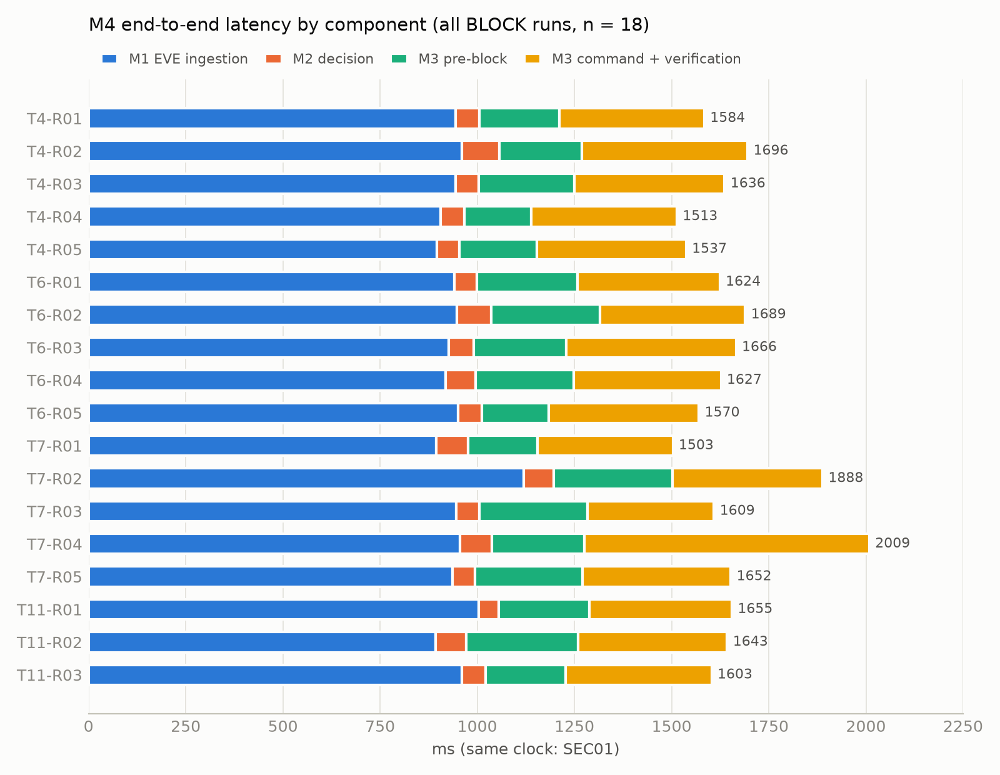

# บทที่ 6 ผลการทดลองและอภิปรายผล

บทนี้รายงานผลของการทดลองตามวิธีในบทที่ 5 ทุกตัวเลขมาจากชุดข้อมูลที่ freeze แล้ว หลังการ freeze ไม่มีการรันซ้ำ และไม่มีการเปลี่ยนแปลงฐานข้อมูล ผลการทดลอง timestamp
หรือค่าที่ใช้คำนวณ metrics (การแก้ไขถ้อยคำในเอกสารประกอบภายหลัง freeze อยู่ในหัวข้อ 5.8.3)
T1–T10 รันบน revision `236ce70` ส่วน T11 รันบน `d0a346d` (หัวข้อ 5.3.5 และภาคผนวก ค) ข้อมูลของฐานข้อมูลที่ freeze อยู่ในภาคผนวก ก

## 6.1 ผลการทดสอบเชิงฟังก์ชัน (T1–T11)

ตาราง 6.1 สรุปผลของแต่ละ test เทียบกับ expected ผลราย run อยู่ในภาคผนวก ข

**ตาราง 6.1** ผลการทดสอบ T1–T11 (58 runs)

| Test | Scenario | Expected | ผลที่ได้ (ทุก run) | Runs | ผล |
|---|---|---|---|---|---|
| T1 | ทราฟฟิกปกติ (ไม่ inject) | MONITOR · ไม่มี block | ไม่มีแถวใหม่ในตาราง audit ใด ๆ · pf table ว่าง · HEALTHY ตลอด · ไม่มี WARNING/ERROR | 5 | 5/5 PASS |
| T2 | 1 × MEDIUM | MONITOR · ไม่มี block | บันทึก event 1 แถว · ไม่ถึงเกณฑ์ correlation จึงไม่มี decision/action | 5 | 5/5 PASS |
| T3 | 5 × MEDIUM ภายใน 10 s | RULE-002 ALERT | RULE-002 ALERT · risk 69.5 (HIGH) · ไม่มี block | 5 | 5/5 PASS |
| T4 | 5 × HIGH ภายใน 10 s | RULE-001 BLOCK → VERIFIED | RULE-001 BLOCK · risk 79.5 (HIGH) · SUCCESS + VERIFIED · UNBLOCK VERIFIED หลังหมดอายุ | 5 | 5/5 PASS |
| T5 | 5 × HIGH จาก source ใน allowlist | RULE-003 NO_AUTO_BLOCK | RULE-003 NO_AUTO_BLOCK · allowlisted = 1 · C = 0 · risk 67.5 (HIGH) · ไม่มี BLOCK | 5 | 5/5 PASS |
| T6 | block หมดอายุ | UNBLOCK หลัง 300 s → EXPIRED | UNBLOCK VERIFIED ที่ 300.4–301.3 s หลัง block · pf table ว่างหลังจบ | 5 | 5/5 PASS |
| T7 | enforcement verification | VERIFIED | engine read-back VERIFIED · `pfctl -T show` ที่ประมาณ +10 s พบ IP ใน table · traffic-path verification ไม่ได้ทำ | 5 | 5/5 PASS (ระดับ read-back) |
| T8 | Suricata หยุด (restart ใช้ได้) | DEGRADED → restart → HEALTHY | DEGRADED (PROCESS_DOWN ทุก run) → attempt 1 SUCCESS · PID ใหม่ · `stats.uptime` เริ่มนับใหม่ · กลับเป็น HEALTHY | 5 | 5/5 PASS |
| T9 | Suricata หยุด + restart ใช้ไม่ได้ | FAIL → FAIL → CRITICAL · ไม่มี attempt 4 | attempt 1 FAIL → 2 FAIL → 3 CRITICAL · rc = 1 ทุก attempt · ไม่มี attempt 4 · runner latch CRITICAL ไว้จนจบ run | 5 | 5/5 PASS |
| T10a | 1 × HIGH | MONITOR · ไม่มี block | บันทึก event 1 แถว · ไม่มี decision/action · pf table ว่าง | 5 | 5/5 PASS |
| T10b | 4 × HIGH ภายใน 10 s | MONITOR · ไม่มี block | บันทึก event 4 แถว (น้อยกว่า min_events = 5) · ไม่มี decision/action · pf table ว่าง | 5 | 5/5 PASS |
| T11 | 5 × HIGH · Set A/B/C | score เปลี่ยนตาม weight set | ดูหัวข้อ 6.4 · RULE-001 BLOCK VERIFIED ทุกชุด | 3 | บันทึกครบ 3/3 |

T1–T10 ให้ผลตรงตามเกณฑ์ที่กำหนดไว้ครบ 55/55 runs ส่วน T11 เป็น sensitivity analysis จึงไม่ตัดสิน pass/fail

หมายเหตุ

- MONITOR ใน T1, T2 และ T10 เป็นสถานะโดยปริยาย เพราะ alert ไม่ถึงเกณฑ์ correlation จึงไม่มีแถวใน `decisions` (หัวข้อ 3.5)
- ระหว่าง T4-R03, T7-R03 และ T11-R01 Suricata สร้าง alert จริงจากทราฟฟิกของเครือข่าย (IPv6 link-local ไปยัง `ff02::2`) run ละ 1 แถว
  alert เหล่านี้ไม่ใช่ input ของ test จึงไม่ถูกนับในผล (หัวข้อ 5.8.2)

## 6.2 ผลการวัด Latency (M1–M4)

ตาราง 6.2 แสดงสถิติของ M1–M4 ในกลุ่มหลักตามที่กำหนดในหัวข้อ 5.7

**ตาราง 6.2** Latency ของกลุ่มหลัก (ms) — ทุกค่าใช้นาฬิกา SEC01 ทั้งสองปลาย

| Metric | นิยาม | กลุ่ม | n | Mean | Median | Min–Max | SD |
|---|---|---|---|---|---|---|---|
| M1 Detection Latency (EVE ingestion) | `t_detection − t_event` | T3 + T4 | 10 | 910.4 | 903.3 | 833.2–966.3 | 43.5 |
| M2 Decision Latency | `t_decision − t_detection` | T3 + T4 | 10 | 69.2 | 60.4 | 57.2–118.1 | 20.8 |
| M3 Enforcement Latency (รวม) | `t_block_verified − t_decision` | T4 + T7 | 10 | 643.1 | 617.8 | 526.9–971.7 | 126.0 |
| └ ช่วงก่อนเรียก block | `t_block_cmd − t_decision` | T4 + T7 | 10 | 231.2 | 225.0 | 171.9–306.4 | 45.3 |
| └ command + verification | `t_block_verified − t_block_cmd` | T4 + T7 | 10 | 411.9 | 382.7 | 325.4–733.7 | 116.1 |
| M4 End-to-End Response Time | `t_block_verified − t_event` | T4 | 5 | 1,593.4 | 1,584.1 | 1,513.4–1,695.5 | 74.0 |

- **M1** คือ EVE ingestion latency ไม่ใช่เวลาที่ Suricata ใช้ตรวจจับ packet (หัวข้อ 5.5.2)
- **M3** ส่วน `t_block_verified − t_block_cmd` คือ command + verification รวมกัน เพราะ implementation สั่ง block และอ่านกลับในการเรียกครั้งเดียว
  **ค่านี้ไม่ใช่ pure command latency** ส่วนช่วงก่อนเรียก block รวมการบันทึก pattern, risk และ decision ลงฐานข้อมูล
- **M2** ทุก run ในกลุ่มหลักต่ำกว่าเป้าหมายเบื้องต้นของ Blueprint (< 1 s ในห้องปฏิบัติการ) ภายใต้ภาระงานที่ทดสอบ

ค่าเฉลี่ยของ latency แยกตาม test แสดงในตาราง 6.3

**ตาราง 6.3** Latency แยกตาม test (mean, ms)

| Test | n | M1 | M2 | M3 รวม | M4 |
|---|---|---|---|---|---|
| T3 | 5 | 890.1 | 71.4 | — | — |
| T4 | 5 | 930.7 | 66.9 | 595.7 | 1,593.4 |
| T5 | 5 | 882.8 | 57.8 | — | — |
| T6 | 5 | 936.6 | 70.0 | 628.7 | 1,635.3 |
| T7 | 5 | 970.5 | 71.3 | 690.5 | 1,732.3 |
| T11 | 3 | 952.4 | 63.6 | 617.6 | 1,633.7 |

ค่าอ้างอิงจากทุก run ที่มี timestamp (T3–T7, T11) ได้แก่ M1 n = 28 mean 925.4 ms และ M4 n = 18 mean 1,650.3 ms (min–max 1,503.2–2,008.6 ms)
ค่าสูงสุดของ M3 (971.7 ms) และของ command + verification (733.7 ms) มาจาก run เดียวกันคือ T7-R04 ซึ่งบันทึกตามที่วัดได้ ไม่ได้ตัดออก

**รูปที่ 6.1** องค์ประกอบของ M4 ต่อ run (ทุก run ที่มีการ block, n = 18)

## 6.3 ผลด้านความสำเร็จและความปลอดภัย (M5–M10)

ตาราง 6.4 แสดงผลของ M5–M10

**ตาราง 6.4** ผลของ M5–M10

| Metric | ขอบเขต | ผล | สิ่งที่นับ |
|---|---|---|---|
| M5 Detection Success Rate | T1–T4 (20 runs) | 55/55 (100%) | alert ที่ inject ถูกบันทึกใน `security_events` / alert ที่ inject |
| M6 Automated Action Success Rate | T4, T7 | 10/10 (100%) | BLOCK ที่ SUCCESS + VERIFIED / decision BLOCK |
| M7 False Positive Rate under the defined test scenarios | T1, T2, T3, T10 (25 runs) | **0/25** | run ที่มี BLOCK action / run ของสถานการณ์ที่ไม่ควร block |
| M8 Allowlist Safety Success Rate | T5 | 5/5 (100%) | allowlisted source ที่ไม่ถูก block / allowlisted critical tests |
| M9 Auto-Unblock Success Rate | T6 | 5/5 (100%) | UNBLOCK VERIFIED / block ที่หมดอายุ |
| **M10 Recovery Success Rate** | T8 (recoverable failure) | **5/5 (100%)** | กู้คืนสำเร็จ / failure ที่ inject |

ค่าอ้างอิงที่ขยายขอบเขต: M5 ของทุก run ที่ inject = 170/170 · M6 ของทุก run ที่ block (T4, T6, T7, T11) = 18/18 · M9 ของทุก block = 18/18
และเมื่อจบการทดลองไม่มี `active_blocks` ที่ยังไม่ EXPIRED

M5 เป็น detection success rate under the defined laboratory test scenarios ไม่ใช่ detection rate ของ Suricata ส่วน M7 เป็นผลของชุดทดสอบนี้เท่านั้น
ความหมายคือ no unnecessary block was observed in the predefined non-block scenarios used in this experiment (M7: 0/25)

### 6.3.1 Recovery Failure Handling (T9)

ผลของ T9 รายงานแยกจาก M10 ในตาราง 6.5

**ตาราง 6.5** ผลของ T9 (รายงานแยกจาก M10 · ครอบคลุม M12)

| รายการ | ผล |
|---|---|
| run ที่ได้ FAIL → FAIL → CRITICAL ครบ | 5/5 |
| rc ของคำสั่ง restart | 1 ทุก attempt (15/15) |
| run ที่มี attempt ที่ 4 | 0/5 |
| ระยะจาก attempt 1 ถึง attempt 3 | น้อยกว่า 1 s ทุก run |
| หลังเข้า CRITICAL | runner latch สถานะไว้ ไม่สั่ง restart ซ้ำ · health loop ทำงานต่อ |

ถ้ารวม T8 กับ T9 ในสูตรเดียว จะได้ 5/10 ค่านี้ใช้เป็นข้อมูลประกอบเท่านั้น เพราะ T9 ออกแบบให้กู้ไม่ได้ ค่ารวมจึงไม่ได้สะท้อนความสามารถในการกู้คืน
(หัวข้อ 5.6.1)

### 6.3.2 Recovery Time ของ T8 (supplementary measurement)

ตาราง 6.6 แสดงเวลาตั้งแต่สั่งหยุด Suricata จนบันทึกการกู้คืนสำเร็จใน T8

**ตาราง 6.6** เวลากู้คืนใน T8 (ms)

| การวัด | n | Mean | Median | Min–Max | SD |
|---|---|---|---|---|---|
| `t_recovery_success − t_fault` | 5 | 26,357.0 | 26,340.5 | 26,275.2–26,487.0 | 82.0 |

ค่านี้**ไม่ใช่ M11 ตามนิยามของ Blueprint** (`T_service_healthy − T_failure_detected`) เพราะเริ่มนับจากเวลาที่สั่งหยุด Suricata (`t_fault`)
ไม่ใช่เวลาที่ระบบตรวจพบ ช่วงที่วัดจึงรวมเวลารอให้ health check รอบถัดไป (ทุก 15 s) ตรวจพบ + restart + รอ stats จาก process ใหม่
รายงานนี้จึงใช้ค่านี้เป็น supplementary measurement และถือว่า M11 ตามนิยามไม่ได้วัด (หัวข้อ 6.8.2)

## 6.4 Sensitivity Analysis (T11)

ตาราง 6.7 แสดงคะแนน ระดับความเสี่ยง และ action ของ weight set ทั้งสามชุด

**ตาราง 6.7** ผลของ weight set ต่อ pattern เดียวกัน (5 × HIGH ภายใน 10 s, source ภายนอก)

| Weight set | S | F | T | C | Risk score | Risk level | Rule | Decision | Enforcement |
|---|---|---|---|---|---|---|---|---|---|
| A | 75 | 70 | 100 | 80 | 79.5 | HIGH | RULE-001 | BLOCK | VERIFIED |
| B | 75 | 70 | 100 | 80 | 80.5 | CRITICAL | RULE-001 | BLOCK | VERIFIED |
| C | 75 | 70 | 100 | 80 | 78.5 | HIGH | RULE-001 | BLOCK | VERIFIED |

ตอบสามคำถามของ M14 ได้ดังนี้ (1) score เปลี่ยน (2) risk level เปลี่ยนเฉพาะ Set B ซึ่งข้ามเกณฑ์ CRITICAL (≥ 80) (3) decision ไม่เปลี่ยน

> Under the tested input pattern, changing the weight set changed the numerical risk score and risk classification, but did
> not change the resulting rule-based action; all three sets resulted in RULE-001 BLOCK with successful verification.

ผลนี้เป็น sensitivity analysis ไม่ใช่ optimization รายงานนี้จึงไม่จัดอันดับว่า weight set ใดดีกว่า

## 6.5 การบรรลุวัตถุประสงค์ (O1–O11)

**ตาราง 6.8** สถานะของวัตถุประสงค์จากผลการทดลอง

| Objective | สถานะ | หลักฐาน |
|---|---|---|
| O1 รับ security event จาก Suricata (EVE JSON) | บรรลุ | alert ที่ inject ถูกบันทึกครบ 170/170 |
| O2 Event correlation | บรรลุ | pattern ที่ถึงเกณฑ์ถูก correlate (T3, T4, T5, T6, T7, T11) · pattern ที่ต่ำกว่าเกณฑ์ไม่ถูก correlate (T2, T10a, T10b) |
| O3 แบบจำลองการประเมินความเสี่ยง | บรรลุ | S/F/T/C และ risk score ตรงกับค่าที่คำนวณจาก model (Set A 79.5) · Set B/C ให้ค่าตามน้ำหนัก (T11) |
| O4 Rule-based automated response | บรรลุ | RULE-001/002/003 ให้ผลตามที่กำหนดทุก run (T3, T4, T5) |
| O5 Temporary block บน pfSense | บรรลุ | BLOCK SUCCESS + VERIFIED 18/18 |
| O6 Auto-unblock | บรรลุ | T6 5/5 · ทุก block ในชุดข้อมูลถูกปลดสำเร็จ 18/18 |
| O7 ตรวจว่า firewall บังคับใช้จริง | **บรรลุบางส่วน** (ระดับ read-back) | Firewall state enforcement was verified through engine and pfctl read-back (engine 18/18 · `pfctl` ใน T7 5/5); direct traffic-path verification was not available in the experimental environment. |
| O8 Allowlist safety | บรรลุ | T5 5/5 ไม่ถูก block |
| O9 Audit trail ที่อธิบายเหตุผลได้ | บรรลุ | ทุกแถวผูกกับ run ได้และไม่มีแถว orphan · สายย้อนกลับ event → pattern → risk → decision → action ครบ · `decisions.reason` ระบุเงื่อนไขที่ match |
| O10 Functional recovery (retry ≤ 3) | บรรลุ | T8 กู้คืน 5/5 · T9 หยุดที่ 3 attempts 5/5 |
| O11 วัดประสิทธิภาพ | **บรรลุบางส่วน** | วัด latency, scenario-defined unnecessary block และ sensitivity ได้ · **overhead (CPU/RAM/PPS) ไม่ได้วัด** |

## 6.6 อภิปรายผล

### 6.6.1 ผลโดยรวม

ภายใต้เงื่อนไขที่กำหนด เส้นทาง event → correlation → risk → rule → block → verify → unblock ทำงานครบทุก run ที่ออกแบบให้ block (18/18)
และไม่เกิด block ในทุก run ที่ออกแบบให้ไม่ block (25 runs) รวมถึง source ที่อยู่ใน allowlist (5 runs) ผลที่ได้เป็นไปตาม rule ที่กำหนดไว้ล่วงหน้าอย่างสม่ำเสมอ
ในทุก run ที่ทดสอบ ซึ่งเป็นสิ่งที่คาดได้จากระบบแบบ rule-based ที่ใช้ input ควบคุม

### 6.6.2 เวลาของ M4 อยู่ที่ส่วนใด

ใน T4 ค่าเฉลี่ยของ M1 (930.7 ms) คิดเป็นประมาณ 58% ของ M4 (1,593.4 ms) ส่วน M2 (66.9 ms) ประมาณ 4% และ M3 (595.7 ms) ประมาณ 37% รูปที่ 6.1
แสดงสัดส่วนใกล้เคียงกันในทุก run ที่มีการ block เวลาส่วนใหญ่จึงอยู่ที่**การส่ง event เข้า engine** และ**การสื่อสารกับ pfSense ผ่าน SSH** ไม่ใช่ตรรกะ
correlation และการตัดสินใจ

M1 ในการทดลองนี้รวมการส่ง event ผ่าน SSH ไปต่อท้าย `eve.json` และการอ่านกลับผ่าน `tail` ทาง SSH จึงสะท้อนกลไก ingestion ของห้องปฏิบัติการนี้
ถ้า engine อ่าน EVE บนเครื่องเดียวกับ Suricata หรือใช้ช่องทางอื่น ค่านี้อาจต่างไป แต่การทดลองนี้ไม่ได้วัดกรณีดังกล่าว

### 6.6.3 การตัดสินใจเทียบกับการบังคับใช้

ตรรกะภายใน engine (M2 mean 69.2 ms กลุ่ม T3 + T4) ใช้เวลาประมาณหนึ่งในเก้าของ M3 (643.1 ms กลุ่ม T4 + T7) ความแปรปรวนสูงสุดอยู่ที่ command + verification
(SD 116.1 ms, สูงสุด 733.7 ms) ซึ่งสอดคล้องกับการที่ขั้นนี้ขึ้นกับ SSH round-trip สองครั้ง (`-T add` และ `-T show`) และภาระของ pfSense
เนื่องจากแยกเวลาของคำสั่งกับเวลา verification ไม่ได้ จึงบอกไม่ได้ว่าความแปรปรวนนี้เกิดจากส่วนใดมากกว่า

### 6.6.4 ผลของ allowlist

allowlist มีผลสองชั้นตามที่ออกแบบ ในชั้น risk ทำให้ factor C เป็น 0 (risk 67.5 แทน 79.5) แต่คะแนนยังอยู่ในระดับ HIGH ไม่ได้เป็นศูนย์ ในชั้น rule
RULE-003 NO_AUTO_BLOCK มีลำดับก่อน RULE-001 ผลของ T5 จึงแสดงว่าการป้องกันไม่ให้ block ไม่ได้อาศัยการลดคะแนน แต่เป็นการ override ในขั้นตัดสินใจ
โดยตรง ขณะที่เหตุการณ์ยังถูกบันทึกพร้อมคะแนนความเสี่ยงให้ผู้ดูแลเห็น

### 6.6.5 พฤติกรรมการกู้คืนเทียบกับการออกแบบ

ใน T8 ทุก run กู้คืนสำเร็จที่ attempt แรก และเวลาจากการสั่งหยุดถึงการกู้คืนสำเร็จอยู่ในช่วงแคบ (26,275.2–26,487.0 ms) การทดลองไม่ได้บันทึกเวลาที่ระบบตรวจพบ failure
จึงแยกไม่ได้ว่าเวลานี้เป็นช่วงรอการตรวจพบเท่าใดและเป็นการกู้คืนเท่าใด
ใน T9 ระบบหยุดที่ 3 attempts และคงสถานะ CRITICAL ไว้ตามข้อกำหนด retry ≤ 3 แต่ attempt ทั้งสามเกิดติดกันภายในไม่ถึง 1 s เพราะเมื่อ restart ล้มเหลว
loop จะไปยัง attempt ถัดไปทันที (หัวข้อ 4.11) ในทางปฏิบัติ การ retry แบบนี้จึงไม่ได้เว้นเวลาให้ปัญหาชั่วคราวหายไปเองก่อนลองใหม่

### 6.6.6 ผลของ weight set

weight set เปลี่ยน risk score ได้ประมาณ ±1 คะแนน และทำให้ Set B ข้ามเกณฑ์ CRITICAL แต่ action ไม่เปลี่ยน สาเหตุเป็น**เชิงโครงสร้าง** ไม่ใช่เพราะคะแนน
บังเอิญอยู่ในช่วงเดียวกัน เงื่อนไขของ rule ใน `rules.yaml` ใช้ severity ของ alert, จำนวน event ต่อ source, time window และสถานะ allowlist
**ไม่ใช้ `risk_level` หรือ `risk_score`** ซึ่งถูกเก็บไว้เพื่อ audit และการอธิบาย (หัวข้อ 3.7) ใน implementation นี้ weight set จึงเปลี่ยนคะแนนและระดับที่แสดงใน
audit trail ได้ แต่ไม่มีเส้นทางที่จะเปลี่ยน action ไม่ว่า pattern ใด T11 ยืนยันพฤติกรรมนี้เชิงประจักษ์ แต่ไม่ได้บอกว่าชุดใดเหมาะสมกว่า

Risk assessment provides a weighted assessment of the correlated pattern, while the Rule Engine determines the response action
according to predefined conditions.

### 6.6.7 ขอบเขตของการนำผลไปใช้

input เป็น controlled injection จาก source เดียว (TEST-NET) บนห้องปฏิบัติการที่มีทราฟฟิกน้อย การทดลองไม่ได้ครอบคลุมทราฟฟิกจริงปริมาณมาก หลาย source
พร้อมกัน หรือการโจมตีที่ rule ของ Suricata ไม่ครอบคลุม ไม่ได้วัด overhead และแต่ละ test มีเพียง 5 runs ผลจึงใช้ได้ภายใต้เงื่อนไขการทดลองที่กำหนดเท่านั้น
ไม่ควรตีความเป็นประสิทธิภาพระดับ production

## 6.7 ข้อค้นพบ (Findings)

- **F1** ภายใต้ controlled network environment และ predefined rules ระบบ correlate IDS events แล้วนำไปสู่ predefined firewall response
  พร้อม verification และ lifecycle management ได้ครบทุก run ที่คาดให้ block (M6 10/10, M9 5/5) และวัด end-to-end response time ได้จริง
  (M4 mean 1,593.4 ms ใน T4)
- **F2** เวลาส่วนใหญ่ของเส้นทางอัตโนมัติอยู่ที่ EVE ingestion (ประมาณ 58% ของ M4 ใน T4) และขั้น enforcement ตั้งแต่ตัดสินใจจนยืนยันผล (M3 ประมาณ 37%)
  ส่วน correlation และการตัดสินใจใช้ประมาณ 4%
- **F3** ภายใต้สถานการณ์ที่ทดสอบ ไม่พบ block ที่ไม่ควรเกิด (M7 0/25) และ source ใน allowlist ไม่ถูก block (M8 5/5) ผลนี้จำกัดอยู่ในสถานการณ์ที่ทดสอบ
  และไม่ได้พิสูจน์ว่าระบบไม่มี false positive
- **F4** ระบบกู้คืน Suricata ได้เมื่อ restart ใช้ได้ (M10 5/5) และหยุด retry ที่ 3 ครั้งเมื่อกู้ไม่ได้ (T9 5/5) แต่ไม่มีช่วงรอระหว่าง attempt
- **F5** weight set มีผลต่อ risk score และ risk level แต่ไม่เปลี่ยน action เพราะเงื่อนไขของ rule ไม่อิง risk level risk score จึงทำหน้าที่อธิบายการตัดสินใจ
  (explainability) ไม่ใช่ตัวกำหนด action

## 6.8 ข้อจำกัด

### 6.8.1 ข้อจำกัดตาม Blueprint §15.3

**Risk Model** — The proposed risk scoring model is a rule-based weighted model developed for the controlled experimental
environment. The weights and normalization mappings are experimental design parameters and are not claimed to represent a
universal industry standard. (แนวคิดของแบบจำลองอ้างอิง CVSS v4.0 [8] สำหรับ severity และ NIST incident handling [9], [10] สำหรับการตอบสนอง แต่ไม่ใช่คะแนน
มาตรฐานสากลโดยตรง)

**Detection** — Detection capability depends on the configured Suricata rules and therefore does not represent detection of all
possible attack types.

**Automated Blocking** — Automated blocking may introduce operational risks, particularly in the presence of false positives. The
allowlist and verification mechanisms were therefore included as safety controls.

**Experimental Environment** — The evaluation was conducted in a controlled laboratory environment and should not be interpreted
as production-level performance.

**Recovery** — The recovery mechanism focuses on functional health of Suricata and does not constitute complete service
orchestration or high-availability architecture.

### 6.8.2 ข้อจำกัดที่พบจากการทดลอง

- **L1 Clock offset** — Clock offset between SEC01 and pfSense was not reduced to near-zero. During the second experimental set,
  the measured offset changed from +183.87 ms at the beginning to +162.58 ms at the end. The direction differed from the drift
  observed in the first set. No timestamp compensation was applied. (ค่าที่วัดได้อยู่ในตาราง 6.9 · ต้นชุดที่ 2 resync ไม่ได้เพราะไม่มีสิทธิ์ admin ·
  ชุด T2–T8 ไม่มีค่าท้ายชุด · M1–M4 ในชุดข้อมูลหลักใช้นาฬิกา SEC01 ทั้งสองปลาย จึงไม่ได้รับผลจาก offset นี้โดยตรง)
- **L2 T9 event processing** — The engine remained operational in the health loop after entering CRITICAL, but event-processing
  continuity during CRITICAL was not directly verified because no event was injected during this interval.
- **L3 T9 retry timing** — attempt 1–3 เกิดติดกันภายในไม่ถึง 1 s ไม่มีช่วงรอหรือ backoff ระหว่าง attempt ข้อนี้เป็นลักษณะของ implementation
  ไม่ได้แก้ระหว่างการทดลอง เพื่อให้ implementation ตรงกับชุดข้อมูล
- **L4 T9 error message** — คอลัมน์ `error` ของ `recovery_events` เก็บ `rc=1` ตามด้วยข้อความเตือนของ SSH client (stderr) เพราะ `/usr/bin/false`
  ไม่ได้พิมพ์ข้อความใด ข้อความจึงไม่ได้บอกสาเหตุของ failure แต่ rc = 1 ทุก attempt ยังยืนยัน failure ได้ (`failure_reason` = PROCESS_DOWN ถูกต้อง)
- **L5 Factor C = 30** — ไม่ได้ทดสอบกรณี known lab asset เพราะไม่มี asset ในห้องปฏิบัติการที่ยืนยันบทบาทได้ รายการ asset จึงว่างโดยตั้งใจ ชุดข้อมูลครอบคลุมเฉพาะ
  C = 80 (unknown) และ C = 0 (allowlisted)
- **L6 T7 traffic verification** — ยืนยันได้ระดับ pf table read-back เท่านั้น การยิงทราฟฟิกผ่าน firewall ไม่ได้ทำ เพราะ source ของ input เป็น TEST-NET
  ไม่มี host จริง และไม่ได้เติมผลส่วนนี้
- **L7 Implementation revision** — T11 รันบน revision ต่างจาก T1–T10 (หัวข้อ 5.3.5) ผลของ T1–T10 ไม่เปลี่ยนเพราะใช้ Set A ซึ่งเป็นค่าเริ่มต้น
  แต่ T1–T11 ไม่ได้รันบน revision เดียวกัน
- **L8 Controlled injection** — ชุดข้อมูลหลักไม่ได้ใช้ packet จริงผ่าน Suricata M1 จึงเป็น EVE ingestion latency และทราฟฟิกจริงจาก Kali ไม่อยู่ในชุดข้อมูล
  input ยังเป็น burst ที่ event ทุกตัวมี timestamp เดียวกัน (factor T = 100) ไม่ได้จำลอง event ที่กระจายตลอด window
- **L9 M3 แยกเวลาคำสั่งกับเวลา verification ไม่ได้** — รายงาน pure command latency ไม่ได้ (หัวข้อ 5.5.4)
- **L10 ขนาดตัวอย่าง** — 5 runs ต่อ test (T10 10 runs, T11 3 runs) สถิติเป็นเชิงพรรณนาเท่านั้น
- **L11 Overhead ไม่ได้วัด** — ไม่ได้ติดตั้ง Prometheus/Grafana และไม่มีข้อมูล CPU/RAM/PPS ระหว่างการทดลอง M13 จึงไม่ได้วัด และ O11 บรรลุบางส่วน
- **L12 M11 ไม่ได้วัดตามนิยาม** — recovery time ที่มีใช้ `t_fault` เป็นจุดเริ่ม ไม่ใช่ `T_failure_detected` (หัวข้อ 6.3.2)
- **L13 ไม่มี manual baseline** — จึงไม่สามารถสรุปว่าระบบลดเวลาตอบสนองได้เท่าใดเมื่อเทียบกับการทำงานด้วยมือ

**ตาราง 6.9** clock offset ที่สังเกตได้ (ค่าบวก = SEC01 ช้ากว่า pfSense, ms)

| ชุด | จุดที่วัด | resync | offset min / max / mean |
|---|---|---|---|
| DRYRUN-T4 | ก่อน | สำเร็จ | +157.86 / +158.96 / +158.00 |
| ชุดที่ 1 (T1) | ก่อน | สำเร็จ | +169.21 / +169.39 / +169.32 |
| ชุดที่ 1 (T1) | หลัง T1 | — | +186.29 / +186.40 / +186.35 |
| ชุดที่ 1 (T2–T8) | หลัง | — | ไม่ได้วัด |
| ชุดที่ 2 (T9–T11) | ก่อน | ไม่ได้ resync (ไม่มีสิทธิ์ admin) | +183.70 / +183.98 / +183.87 |
| ชุดที่ 2 (T9–T11) | หลัง | — | +162.30 / +163.30 / +162.58 |

ระหว่าง T1 offset เพิ่มขึ้นประมาณ 1.1 ms ต่อนาที แต่ในชุดที่ 2 offset ลดลง 21.3 ms ในเวลาประมาณ 40 นาที ซึ่งเป็นทิศตรงข้ามกัน การทดลองนี้ไม่ได้หาสาเหตุ

### 6.8.3 ความแตกต่างจากแผนการทดลอง (experimental deviations)

รายการในตาราง 6.10 บันทึกไว้ในบทที่ 5 และมีผลต่อการตีความ จึงรวบรวมไว้ที่นี่ด้วย

**ตาราง 6.10** ความแตกต่างระหว่างแผนการทดลองกับสิ่งที่ทำจริง

| หัวข้อ | แผน | สิ่งที่ทำจริง | ผลต่อการตีความ |
|---|---|---|---|
| T1 input | generator ส่ง `stats` | ไม่ inject อะไรเลย ใช้ `stats` จริงของ Suricata | ไม่มี stats ปลอมปนกับ health signal |
| T7 | read-back + traffic test | read-back อย่างเดียว | O7 บรรลุบางส่วน (L6) |
| T9 | ตรวจว่า engine ยังประมวลผล event ต่อได้ | ไม่ได้ inject event ระหว่าง CRITICAL | ยืนยันได้เพียงว่า health loop ทำงานต่อ (L2) |
| Clock protocol | resync ต้นทุกชุด + วัดท้ายทุกชุด | ชุดที่ 2 resync ไม่ได้ · T2–T8 ไม่มีค่าท้ายชุด | offset ใช้เป็นบริบทเท่านั้น (L1) |
| Code revision | revision เดียวตลอดการทดลอง | T11 ใช้ revision ที่แก้การส่ง weight set | ระบุ revision แยก (L7) |
